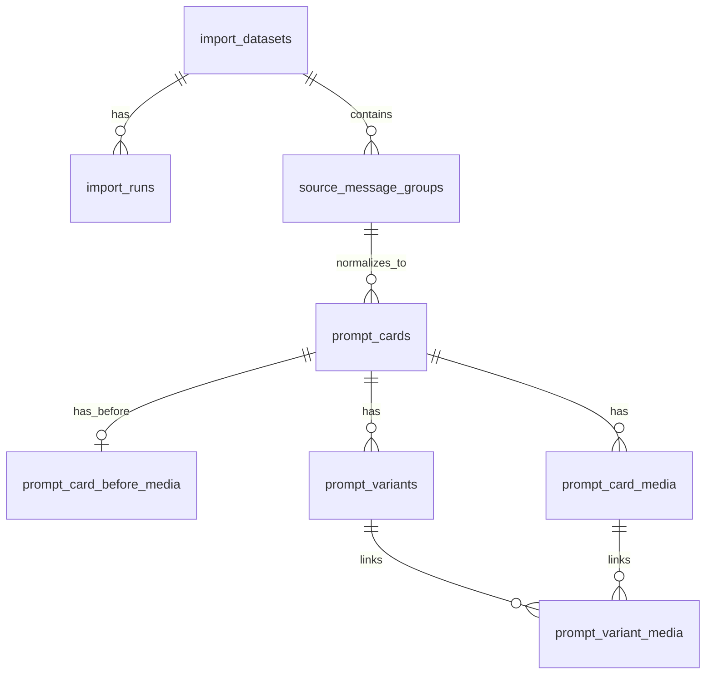

# Parser + DB Requirements (Implementation Spec)

**Date:** 10.03.2026  
**Project:** aiphoto  
**Status:** implementation-ready  
**Scope in this phase:**  
1) parsing Telegram exports,  
2) persisting normalized data to Supabase.

This document is the canonical engineering spec for phase 1-2.  
Website rendering and generation logic are intentionally out of scope.

**Cross-doc note:** SEO выдача и route retrieval описаны в `11-03-seo-card-retrieval-requirements.md`; SEO дерево и index/noindex правила — в `07-03-prompt-landing-plan.md`; словарь измерений — в `10-03-hashtag-extraction-tz.md`.

---

## 0.1 Document Sync Contract

Если меняется DB-контракт (таблицы/поля для `seo_tags`, warnings, языковых вариантов), обязательно ревьюить:

- `10-03-hashtag-extraction-tz.md` — актуальность измерений и структуры `seo_tags`;
- `11-03-seo-card-retrieval-requirements.md` — актуальность полей для route retrieval;
- `07-03-prompt-landing-plan.md` — соответствие index/noindex и route-комбинаций новым данным.

Мини-чеклист:

- [ ] все поля, используемые retrieval, реально сохраняются parser/ingest;
- [ ] типы и названия SEO-измерений совпадают с тегированием;
- [ ] языковые поля достаточны для RU/EN разделения выдачи;
- [ ] `seo_tags` содержит только 5 content-измерений (73 значения: 22 audience + 18 style + 7 occasion + 21 object + 5 doc_task);
- [ ] `intent_action` не присваивается карточкам — покрывается статическими хабами (Раздел 2);
- [ ] `intent_modifier` и `tool_tag` исключены из карты — ведут на homepage;
- [ ] маппинг URL → queries актуален (`docs/11-03-seo-url-query-mapping.csv`).

---

## 1. Problem Statement

We need a deterministic, repeatable ingestion pipeline that transforms Telegram HTML exports into structured entities for a future SEO landing.

Input is already available in `docs/export/*`.  
Output must be clean, queryable, and idempotently stored in Supabase.

---

## 2. Scope / Non-Scope

## In Scope

- Parse Telegram HTML export files (`messages*.html`) from `docs/export`.
- Group `default + joined` blocks into one logical post-group.
- Extract text, prompts, tags, links, media, metadata.
- Support multi-photo / multi-prompt post patterns with explicit mapping.
- Upload media to Supabase Storage.
- Persist raw and normalized data to Supabase Postgres.
- Persist SEO-ready tag dimensions (`seo_tags`) for future programmatic pages.
- Collect unknown terms and generate dictionary candidates (auto-suggest pipeline).
- Provide run-level observability and replay safety.

## Out of Scope

- Deduplication logic (separate doc).
- SEO page generation logic.
- Ranking/recommendation/search.
- Generation pipeline and payment flow.
- Automatic publishing of new tags to production dictionary without manual approval.

---

## 3. Product Context (from brainstorm + existing docs)

Global product has four layers:
1. parsing,
2. database ingestion,
3. SEO landing serving data,
4. generation logic.

This spec covers only layers 1 and 2.

Key strategic constraint: DB model must be future-proof for layer 3 (programmatic SEO), therefore we store structured relations, not flat blobs only.

---

## 4. Input Contract

## 4.1 Source location

- Root: `docs/export/`
- Dataset examples:
  - `docs/export/lexy_15.02.26/`
  - `docs/export/nanoBanano_17.03.26/`

## 4.2 Dataset contents

Expected files:
- `messages.html` (required),
- `messages2.html`, `messages3.html`, ... (optional),
- `css/style.css`, `js/script.js` (ignored),
- media relative paths referenced from HTML:
  - `photos/*`,
  - `video_files/*`,
  - `stickers/*`.

## 4.3 Telegram HTML structure assumptions

- History container: `.page_body.chat_page .history`
- Service messages: `div.message.service`
- Group start: `div.message.default.clearfix#messageNNN`
- Group continuation: `div.message.default.clearfix.joined#messageNNN`
- Prompt block: `<blockquote>...</blockquote>`
- Photo anchor: `a.photo_wrap[href]`
- Video anchor: `a.video_file_wrap[href]`
- Hashtag anchor: `onclick="return ShowHashtag(...)"` (detected but ignored for final tagging)

If layout deviates, parser must fail gracefully with warnings/errors, not crash entire run.

---

## 5. Pipeline Architecture

---

## 6. Core Parsing Rules

## 6.1 File ordering

Per dataset:
- `messages.html` first,
- then numeric order for `messagesN.html`.

## 6.2 Grouping rule

Logical post-group:
- starts at `default` (without `joined`);
- includes all following `joined`;
- ends before next `default`/`service`/EOF.

If file starts with orphan `joined`, create recoverable group and add warning `orphan_joined`.

## 6.3 Relevance filter

A group becomes a candidate `prompt_card` if:
1. contains at least one `<blockquote>`,
2. contains at least one photo (`photo_wrap`).

Skip reasons:
- `skipped_no_blockquote`
- `skipped_no_photo`
- `skipped_video_only`

## 6.4 Field extraction

From group:
- `source_message_id`: numeric from first group node id.
- `source_message_ids`: all ids in group.
- `source_published_at`: first valid `.date.details[title]`.
- `raw_text_html`: concatenated `.text` html.
- `raw_text_plain`: html-to-text normalized.
- `title_raw`: first `<strong>` in first text block.
- `title_normalized`: cleaned title (<=120 chars).
- `hashtags`: reserved field, filled only from prompt-based tagging stage; parser sets empty array (`{}`).
- `media`: all photo/video anchors with index and paths.

## 6.5 Prompt extraction

Each `<blockquote>` becomes one prompt variant:
- `variant_index` (0-based order),
- `label_raw` (nearest marker like `Кадр 1`, `Промпт`, `Scene 2`),
- `prompt_text_ru`,
- `prompt_text_en` (null for now),
- `prompt_normalized_ru` (basic cleanup only in this phase),
- `prompt_normalized_en` (null for now).

---

## 7. Photo-Prompt Mapping (Critical)

We explicitly support variable cardinality.

| Case | Condition | Mapping strategy | Warning |
|---|---|---|---|
| A | 1 photo, 1 prompt | 1->1 | none |
| B | N photos, 1 prompt | prompt linked to all photos | none |
| C | N photos, N prompts | index-based (`i -> i`) | none |
| D1 | N photos, M prompts, `N > 1` and `M > 1`, `N = M` | split into `M` cards: each card keeps 1 prompt + 1 photo | none |
| D2 | N photos, M prompts, `N > 1` and `M > 1`, `N > M` and `N % M = 0` | split into `M` cards: each prompt gets `N/M` photos | none |
| D3 | N photos, M prompts, `N > 1` and `M > 1`, `N > M` and `N % M != 0` | split into `M` cards with deterministic remainder distribution | `photo_prompt_count_mismatch` |
| D4 | N photos, M prompts, `N > 1` and `M > 1`, `N < M` | split into `M` cards; photos are cyclically reused | `photo_prompt_count_mismatch` |

Why this matters: downstream SEO needs explicit "which visual belongs to which prompt variant".

---

## 8. Data Model (Supabase)

## 8.1 ER overview

## 8.2 Why each table exists

- `import_datasets`: registry of import sources (one folder = one dataset).
- `import_runs`: audit and metrics for every parser execution.
- `source_message_groups`: raw normalized snapshot of Telegram grouped messages.
- `prompt_cards`: business entity served to website layer; one source message can produce multiple split cards.
- `prompt_card_media`: media objects for each card (photo/video metadata + storage pointer).
- `prompt_variants`: each parsed prompt inside card.
- `prompt_variant_media`: explicit relation of variants to media.
- `prompt_tag_candidates`: dictionary candidate terms discovered during parse/post-process.
- `prompt_tag_candidate_examples`: evidence snippets for candidate review.

---

## 9. Postgres Schema (DDL-level requirements)

## 9.1 `import_datasets`

- `id uuid pk default gen_random_uuid()`
- `dataset_slug text not null unique`
- `channel_title text not null`
- `source_type text not null default 'telegram_html_export'`
- `is_active boolean not null default true`
- `created_at timestamptz not null default now()`
- `updated_at timestamptz not null default now()`

## 9.2 `import_runs`

- `id uuid pk default gen_random_uuid()`
- `dataset_id uuid not null references import_datasets(id)`
- `mode text not null check (mode in ('backfill','incremental'))`
- `status text not null check (status in ('running','success','partial','failed'))`
- `started_at timestamptz not null default now()`
- `finished_at timestamptz null`
- `html_files_total int not null default 0`
- `groups_total int not null default 0`
- `groups_parsed int not null default 0`
- `groups_skipped int not null default 0`
- `groups_failed int not null default 0`
- `error_summary text null`
- `meta jsonb not null default '{}'::jsonb`

## 9.3 `source_message_groups`

- `id uuid pk default gen_random_uuid()`
- `dataset_id uuid not null references import_datasets(id)`
- `run_id uuid not null references import_runs(id)`
- `source_group_key text not null`
- `source_message_id bigint not null`
- `source_message_ids bigint[] not null`
- `source_published_at timestamptz not null`
- `raw_text_html text null`
- `raw_text_plain text null`
- `raw_payload jsonb not null default '{}'::jsonb`
- `created_at timestamptz not null default now()`
- `updated_at timestamptz not null default now()`

Constraints:
- `unique(dataset_id, source_message_id)`

## 9.4 `prompt_cards`

- `id uuid pk default gen_random_uuid()`
- `source_group_id uuid not null references source_message_groups(id) on delete cascade`
- `card_split_index int not null default 0`
- `card_split_total int not null default 1`
- `split_strategy text not null default 'single_card'`
- `slug text null`
- `title_ru text not null`
- `title_en text null`
- `hashtags text[] not null default '{}'` — content tags из текста промта
- `tags text[] not null default '{}'`
- `seo_tags jsonb not null default '{}'::jsonb` — 5 content-измерений (73 значения) из промта: `audience_tag` (22), `style_tag` (18), `occasion_tag` (7), `object_tag` (21), `doc_task_tag` (5). Полный словарь: `10-03-hashtag-extraction-tz.md` §5.5-5.9
- `seo_readiness_score int not null default 0`
- `source_channel text not null`
- `source_dataset_slug text not null`
- `source_message_id bigint not null`
- `source_date timestamptz not null`
- `parse_status text not null check (parse_status in ('parsed','parsed_with_warnings','failed'))`
- `parse_warnings jsonb not null default '[]'::jsonb`
- `is_published boolean not null default false`
- `sort_order int not null default 0`
- `created_at timestamptz not null default now()`
- `updated_at timestamptz not null default now()`

Constraints:
- `unique(source_dataset_slug, source_message_id, card_split_index)`
- `check(card_split_total >= 1)`
- `check(card_split_index >= 0 and card_split_index < card_split_total)`
- `check(seo_readiness_score >= 0 and seo_readiness_score <= 100)`

Note:
- `slug` is intentionally nullable in phase 1-2.
- URL strategy will be finalized later at website architecture stage.

---

## 9.5 `prompt_card_media`

- `id uuid pk default gen_random_uuid()`
- `card_id uuid not null references prompt_cards(id) on delete cascade`
- `media_index int not null`
- `media_type text not null check (media_type in ('photo','video'))`
- `storage_bucket text not null default 'prompt-images'`
- `storage_path text not null`
- `original_relative_path text not null`
- `thumb_relative_path text null`
- `is_primary boolean not null default false`
- `width int null`
- `height int null`
- `mime_type text null`
- `file_size_bytes bigint null`
- `created_at timestamptz not null default now()`

Constraints:
- `unique(card_id, media_index)`
- `unique(storage_bucket, storage_path)`

## 9.5b `prompt_card_before_media` (0..1 source image per card)

- `id uuid pk default gen_random_uuid()`
- `card_id uuid not null unique references prompt_cards(id) on delete cascade`
- `storage_bucket text not null default 'prompt-images'`
- `storage_path text not null`
- `original_relative_path text null`
- `mime_type text null`
- `file_size_bytes bigint null`
- `source_rule text not null default 'manual_admin'`
- `created_at timestamptz not null default now()`
- `updated_at timestamptz not null default now()`

Constraints:
- `unique(storage_bucket, storage_path)`

## 9.6 `prompt_variants`

- `id uuid pk default gen_random_uuid()`
- `card_id uuid not null references prompt_cards(id) on delete cascade`
- `variant_index int not null`
- `label_raw text null`
- `prompt_text_ru text not null`
- `prompt_text_en text null`
- `prompt_normalized_ru text null`
- `prompt_normalized_en text null`
- `match_strategy text not null`
- `created_at timestamptz not null default now()`

Constraints:
- `unique(card_id, variant_index)`

## 9.7 `prompt_variant_media`

- `variant_id uuid not null references prompt_variants(id) on delete cascade`
- `media_id uuid not null references prompt_card_media(id) on delete cascade`
- `created_at timestamptz not null default now()`

PK:
- `(variant_id, media_id)`

## 9.8 `prompt_tag_candidates` (phase 2)

- `id uuid pk default gen_random_uuid()`
- `normalized_term text not null`
- `dimension_guess text not null check (dimension_guess in ('audience_tag','occasion_tag','style_tag','object_tag','doc_task_tag','unknown'))`
- `hits_total int not null default 1`
- `unique_cards int not null default 1`
- `unique_channels int not null default 1`
- `first_seen_at timestamptz not null default now()`
- `last_seen_at timestamptz not null default now()`
- `status text not null check (status in ('new','suggested','approved','rejected','promoted')) default 'new'`
- `review_note text null`
- `created_at timestamptz not null default now()`
- `updated_at timestamptz not null default now()`

Constraints:
- `unique(normalized_term, dimension_guess)`

## 9.9 `prompt_tag_candidate_examples` (phase 2)

- `id uuid pk default gen_random_uuid()`
- `candidate_id uuid not null references prompt_tag_candidates(id) on delete cascade`
- `card_id uuid null references prompt_cards(id) on delete set null`
- `source_channel text null`
- `context_fragment text not null`
- `created_at timestamptz not null default now()`

---

## 10. Storage Requirements

Bucket:
- `prompt-images` (private for ingestion stage).

Object key pattern:
- `telegram/{dataset_slug}/{source_message_id}/{card_split_index}/{media_index}.{ext}`

Examples:
- `telegram/lexy_15.02.26/1053/0/0.jpg`
- `telegram/nanoBanano_17.03.26/537288/2/1.jpg`

Rules:
- Preserve original extension.
- Store source-relative path in DB for traceability.
- Upload failures do not crash run; affected card gets warning and remains unpublished.

---

## 11. Idempotency, Consistency, Replay

- Upsert identity for card-level entity:
  - `(source_dataset_slug, source_message_id, card_split_index)`.
- Re-run same dataset must not create duplicate cards/media/variants.
- On re-import of existing group:
  - update `prompt_cards`,
  - replace child sets transactionally (`prompt_card_media`, `prompt_variants`, `prompt_variant_media`).

Recommended write pattern:
1. upsert parent `prompt_cards`,
2. delete child rows by `card_id`,
3. insert fresh child rows,
4. commit.

---

## 12. Observability & Operational Requirements

For each run (`import_runs`):
- total files, groups, parsed, skipped, failed;
- per skip reason counters;
- top error categories.
- candidate terms discovered (`new_candidates`);
- candidates moved to `suggested` by thresholds;
- candidates rejected by denylist/noise filters.

Log line minimum fields:
- `dataset_slug`
- `source_message_id`
- `stage` (`scan/group/parse/upload/db`)
- `severity`
- `error_code`
- `error_message`.

Exit policy:
- run status `success` if no failures,
- `partial` if failures exist but pipeline completed,
- `failed` if fatal initialization error (e.g., unreadable dataset).

Auto-suggest policy:
- candidate collection must be idempotent (rerun does not duplicate same `normalized_term+dimension_guess`);
- promotion to production dictionary is manual-approval only (`approved -> promoted`).

---

## 13. Performance / Reliability Targets

MVP targets:
- parse throughput: >= 200 groups/min on local run;
- memory: streaming approach preferred, no full DOM retention across files;
- retry:
  - storage upload retries x3 with backoff,
  - DB transient retry x2.

---

## 14. Security & Compliance (Phase 1)

- DB writes via service role only.
- No secrets in repo; all env through runtime config.
- `raw_payload` not exposed to public API in future.
- Media bucket private by default; public serving decided by website layer.

---

## 15. Acceptance Criteria

1. Parser successfully processes existing datasets in `docs/export`.
2. Relevance filter works as specified.
3. Multi-photo/multi-prompt mapping works for cases A/B/C/D.
4. Data persisted in all target tables with consistent relations.
5. Re-run is idempotent by card identity.
6. `import_runs` provides actionable run metrics and errors.
7. `prompt_cards.seo_tags` and `seo_readiness_score` are stored for parsed cards.
8. `seo_tags` contains only 5 content dimensions: `audience_tag`, `style_tag`, `occasion_tag`, `object_tag`, `doc_task_tag`.
9. Unknown terms are collected to `prompt_tag_candidates` with examples.
10. Threshold-based `suggested` status works (`hits_total >= 5`, `unique_cards >= 3`, `unique_channels >= 2`).

---

## 16. Test Plan (Must-Have)

## Unit tests
- grouping algorithm,
- prompt extraction + label detection,
- hashtag/link extraction,
- mapping strategies A/B/C/D.
- `seo_tags` mapping by dimensions.
- seo_tags contains only 5 content dimensions from prompt text.
- candidate normalization + denylist filtering.

## Integration tests
- one end-to-end run on sample dataset,
- storage upload + DB persistence,
- replay run idempotency.
- auto-suggest candidate accumulation across reruns.

## Golden tests
- curated HTML fixtures with expected JSON output snapshots.

---

## 17. Handoff Notes For Implementation Agent

Implement in this order:
1. schema migration,
2. parser core (grouping/extraction),
3. mapping engine (variant-media),
4. storage uploader,
5. db writer (transactional upsert),
6. SEO dimensions mapping (`seo_tags` + `seo_readiness_score`),
7. candidate collector + suggester jobs,
8. run metrics + logs,
9. tests.

Definition of done:
- all acceptance criteria satisfied,
- tests green,
- sample run report attached.
