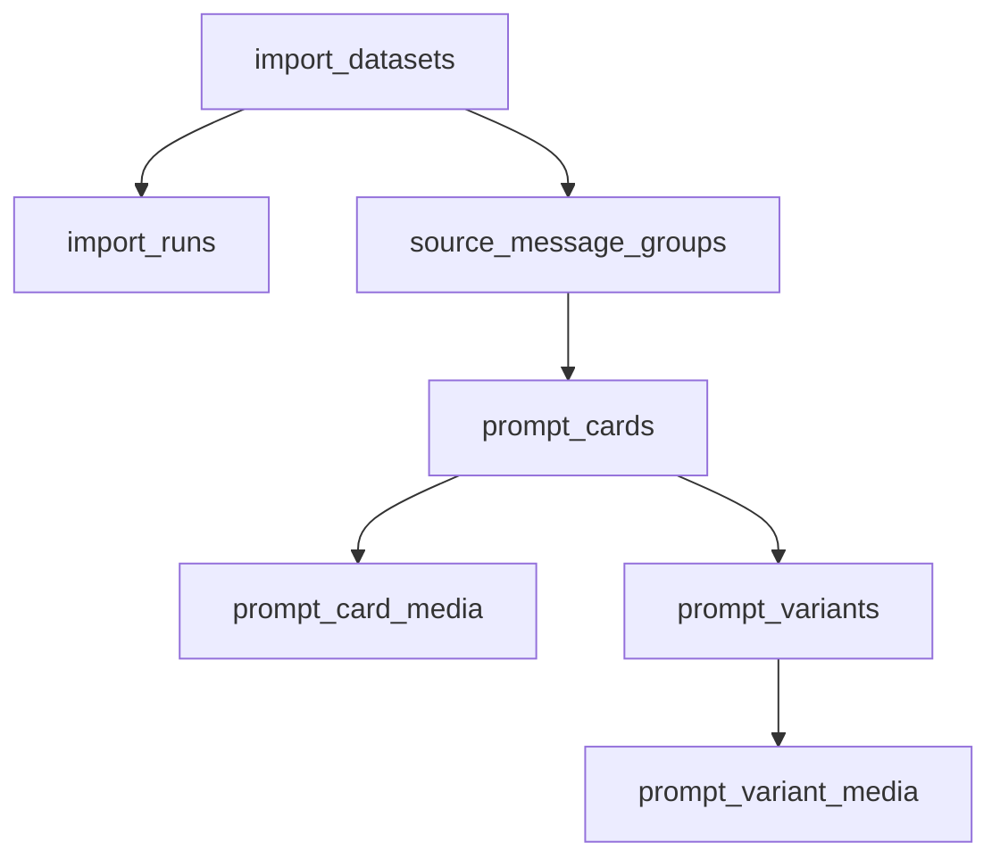

# ТЗ: Парсинг Telegram HTML-экспортов в Supabase (v2)

**Дата:** 10.03.2026  
**Проект:** aiphoto  
**Статус:** ready for implementation  
**Фокус:** парсинг данных из `docs/export` -> структура БД + storage

---

## 1) Что делаем

Строим parser pipeline, который:
- читает Telegram HTML-экспорты из `docs/export/*`;
- извлекает релевантные prompt-card записи;
- нормализует поля;
- пишет в Supabase (`Postgres + Storage`).

В рамках этого ТЗ **не** рассматриваем дедупликацию (вынесено отдельно).

---

## 2) Input: фактическая структура экспорта

Папка источников:
- `docs/export/`

Примеры датасетов:
- `docs/export/lexy_15.02.26/`
- `docs/export/nanoBanano_17.03.26/`

Типичные файлы в датасете:
- `messages.html` (обязателен)
- `messages2.html`, `messages3.html` (если история разбита)
- `css/style.css`, `js/script.js` (игнорируем)
- ссылки в HTML на `photos/*`, `video_files/*`, `stickers/*`

Ключевые HTML-паттерны:
- контейнер истории: `.page_body.chat_page .history`
- сервис: `div.message.service`
- начало поста: `div.message.default.clearfix#messageNNN`
- продолжение: `div.message.default.clearfix.joined#messageNNN`
- фото: `a.photo_wrap[href="photos/..."]`
- видео: `a.video_file_wrap[href="video_files/..."]`
- промт: `blockquote`
- хэштег: `onclick="return ShowHashtag(...)"`.

---

## 3) Алгоритм парсинга (детальный)

### 3.1 Обход файлов

1. Для каждого датасета собрать `messages*.html`.
2. Сортировка: `messages.html` -> `messages2.html` -> `messages3.html`...
3. Из каждого файла читать `.history > .message`.

### 3.2 Группировка в пост

1. Новый post-group начинается на `default` без `joined`.
2. В группу включаются все подряд `joined`.
3. Граница группы:
   - следующий `default` без `joined`, или
   - `service`, или
   - конец файла.

### 3.3 Что извлекаем из группы

- `source_message_id`: id стартового узла (`message1053` -> `1053`).
- `source_message_ids[]`: все id узлов группы.
- `source_published_at`: из `div.date.details[title]`.
- `raw_text_html`: объединенный HTML текст.
- `raw_text_plain`: plaintext (` ` -> newline, strip tags).
- `title_raw`: первый `<strong>` в первом `.text`.
- `prompts[]`: каждый `<blockquote>` по порядку:
  - `index`
  - `label_raw` (если рядом есть `Кадр N:`, `Промпт:`...)
  - `prompt_raw`.
- `hashtags[]`: на этапе Telegram-парсинга всегда пустой массив (`{}`); `ShowHashtag(...)` не используется для разметки.
- `media[]`:
  - `media_index`
  - `media_type` (`photo` / `video`)
  - `source_relative_path`
  - `thumb_relative_path`
  - `is_primary` (первое фото).

### 3.4 Фильтрация релевантности (MVP)

Импортируем как карточку только группы, где:
1) есть минимум один `blockquote`,  
2) есть минимум одно фото (`photo_wrap`).

Пропускаем:
- без blockquote,
- без фото,
- video-only посты для оживления.

### 3.5 Нормализация

- `title_normalized`: очищенный заголовок <= 120 символов.
- `slug`: на этапе parser/db ingestion не генерируем, сохраняем `null`.
- Генерация `slug` переносится на этап проектирования структуры сайта.
- `parse_status`: `parsed | parsed_with_warnings | failed`.
- `parse_warnings[]`: список кодов предупреждений.

### 3.6 Варианты "фото <-> промт" (обязательно)

Это ключевой блок для реальных постов. Внутри одной `message group` могут быть разные кардинальности.

#### Case A: `1 фото -> 1 промт`

- Пример: одна фото-карточка и один `blockquote`.
- Действие: создать 1 вариант (`prompt_variant`) и связать его с 1 фото.

#### Case B: `N фото -> 1 промт` (общий промт на все фото)

- Пример: в группе 3-5 фото и один `blockquote`.
- Действие: создать 1 вариант и привязать к нему все фото группы.

#### Case C: `N фото -> N промтов` (каждому фото свой промт)

- Пример: "Кадр 1", "Кадр 2", ... и соответствующие фото.
- Действие: создать N вариантов, каждому варианту назначить одно фото по индексу.
- Правило сопоставления: `prompt_index == photo_index`.

#### Case D: `N фото -> M промтов`, где `N != M`

- Пример: фото 4, промтов 2.
- Базовое правило:
  - если `N > 1` и `M > 1`, делим группу на `M` карточек;
  - каждая новая карточка содержит один промт и соответствующий набор фото;
  - при `N % M != 0` распределяем остаток детерминированно (первые карточки получают +1 фото).
- Warning `photo_prompt_count_mismatch` обязателен для неидеального распределения (`N % M != 0`).

#### Case E: текст с инструкциями и без blockquote

- Для MVP такая группа не создает `prompt_card` (skip).
- Пишем в `import_runs.meta` счетчик `skipped_no_blockquote`.

#### Case F: blockquote есть, но фото нет

- Для MVP skip, причина `skipped_no_photo`.

Итог: парсер обязан создавать явные связи между промтами и фото, а не хранить их "плоско".

### 3.7 Примеры маппинга (как должно лечь в БД)

#### Пример 1: `3 фото + 1 промт`

- `prompt_cards`: 1 запись
- `prompt_card_media`: 3 записи (media_index 0,1,2)
- `prompt_variants`: 1 запись (variant_index 0)
- `prompt_variant_media`: 3 записи (variant 0 -> media 0,1,2)

#### Пример 2: `2 фото + 2 промта` (Кадр 1/2)

- `prompt_cards`: 2 (split_index 0,1)
- `prompt_card_media`: по 1 фото в каждой карточке
- `prompt_variants`: по 1 промту в каждой карточке
- `prompt_variant_media`: внутри каждой карточки variant 0 -> media 0

#### Пример 3: `4 фото + 2 промта`, без явных меток

- `prompt_cards`: 2 (split_index 0,1)
- `prompt_card_media`: по 2 фото в каждой карточке
- `prompt_variants`: по 1 промту в каждой карточке
- `prompt_variant_media`: внутри каждой карточки variant 0 -> media 0..N

Без warning, так как `4 % 2 = 0` и распределение ровное.

---

## 4) Output contract (объект после parser stage)

`ParsedCard`:
- `dataset_slug` text
- `channel_title` text
- `source_message_id` bigint
- `source_message_ids` bigint[]
- `card_split_index` int
- `card_split_total` int
- `split_strategy` text
- `source_published_at` timestamptz
- `raw_text_html` text
- `raw_text_plain` text
- `title_raw` text
- `title_normalized` text
- `card_slug` text | null
- `prompts_json` jsonb
- `hashtags` text[]
- `parse_status` text
- `parse_warnings` jsonb
- `parser_version` text
- `media` jsonb
- `variants` jsonb (массив промт-вариантов)
- `variant_media_links` jsonb (связи variant <-> media)

`variants` элемент:
- `variant_index` int
- `label_raw` text
- `prompt_text_ru` text
- `prompt_text_en` text | null
- `match_strategy` text (`direct_index`, `label_based`, `fallback_all`, `fallback_tail`)

`variant_media_links` элемент:
- `variant_index` int
- `media_index` int

---

## 5) Supabase schema (целевая)

Ниже структура в формате "зачем таблица нужна", чтобы было прозрачно.

### 5.1 Наглядная схема сущностей

### 5.2 Назначение таблиц простыми словами

- `import_datasets` — реестр входных папок экспорта (`lexy_15.02.26`).
- `import_runs` — журнал каждого запуска парсера и его метрики.
- `source_message_groups` — сырой слой "как было в Telegram" после группировки `default+joined`.
- `prompt_cards` — бизнес-сущность карточки для сайта.
- `prompt_card_media` — все медиа карточки (в первую очередь фото).
- `prompt_variants` — каждый отдельный промт внутри карточки (Кадр 1, Кадр 2, ...).
- `prompt_variant_media` — таблица связей: какие фото относятся к какому варианту промта.

### 5.3 Таблица `import_datasets`

- `id uuid pk default gen_random_uuid()`
- `dataset_slug text unique not null`
- `channel_title text not null`
- `source_type text not null default 'telegram_html_export'`
- `is_active boolean not null default true`
- `created_at timestamptz not null default now()`
- `updated_at timestamptz not null default now()`

### 5.4 Таблица `import_runs`

- `id uuid pk default gen_random_uuid()`
- `dataset_id uuid not null references import_datasets(id)`
- `mode text not null` (`backfill` / `incremental`)
- `status text not null` (`running` / `success` / `partial` / `failed`)
- `started_at timestamptz not null default now()`
- `finished_at timestamptz`
- `html_files_total int not null default 0`
- `groups_total int not null default 0`
- `groups_parsed int not null default 0`
- `groups_skipped int not null default 0`
- `groups_failed int not null default 0`
- `error_summary text`
- `meta jsonb not null default '{}'::jsonb`

### 5.5 Таблица `source_message_groups`

- `id uuid pk default gen_random_uuid()`
- `dataset_id uuid not null references import_datasets(id)`
- `run_id uuid not null references import_runs(id)`
- `source_group_key text not null`
- `source_message_id bigint not null`
- `source_message_ids bigint[] not null`
- `source_published_at timestamptz not null`
- `raw_text_html text`
- `raw_text_plain text`
- `raw_payload jsonb not null default '{}'::jsonb`
- `created_at timestamptz not null default now()`
- `updated_at timestamptz not null default now()`

Constraint:
- `unique(dataset_id, source_message_id)`

### 5.6 Таблица `prompt_cards`

- `id uuid pk default gen_random_uuid()`
- `source_group_id uuid not null references source_message_groups(id) on delete cascade`
- `card_split_index int not null default 0`
- `card_split_total int not null default 1`
- `split_strategy text not null default 'single_card'`
- `slug text null`
- `title_ru text not null`
- `title_en text`
- `hashtags text[] not null default '{}'`
- `tags text[] not null default '{}'`
- `source_channel text not null`
- `source_dataset_slug text not null`
- `source_message_id bigint not null`
- `source_date timestamptz not null`
- `parse_status text not null default 'parsed'`
- `parse_warnings jsonb not null default '[]'::jsonb`
- `is_published boolean not null default false`
- `sort_order int not null default 0`
- `created_at timestamptz not null default now()`
- `updated_at timestamptz not null default now()`

Constraint:
- `unique(source_dataset_slug, source_message_id, card_split_index)`
- `check(card_split_total >= 1)`
- `check(card_split_index >= 0 and card_split_index < card_split_total)`

### 5.7 Таблица `prompt_card_media`

Техмета полей:
- `width/height` — фактический размер изображения в пикселях (для фронта, превью, контроля качества).
- `mime_type` — тип файла (`image/jpeg`, `image/webp`, `video/mp4`) для корректной отдачи/рендера.
- `file_size_bytes` — размер файла для лимитов и оптимизации.

- `id uuid pk default gen_random_uuid()`
- `card_id uuid not null references prompt_cards(id) on delete cascade`
- `media_index int not null`
- `media_type text not null` (`photo`, `video`)
- `storage_bucket text not null default 'prompt-images'`
- `storage_path text not null`
- `original_relative_path text not null`
- `thumb_relative_path text`
- `is_primary boolean not null default false`
- `width int`
- `height int`
- `mime_type text`
- `file_size_bytes bigint`
- `created_at timestamptz not null default now()`

Constraints:
- `unique(card_id, media_index)`
- `unique(storage_bucket, storage_path)`

### 5.7b Таблица `prompt_card_before_media` (0..1 "было" на карточку)

- `id uuid pk default gen_random_uuid()`
- `card_id uuid not null unique references prompt_cards(id) on delete cascade`
- `storage_bucket text not null default 'prompt-images'`
- `storage_path text not null`
- `original_relative_path text`
- `mime_type text`
- `file_size_bytes bigint`
- `source_rule text not null default 'manual_admin'`
- `created_at timestamptz not null default now()`
- `updated_at timestamptz not null default now()`

Constraint:
- `unique(storage_bucket, storage_path)`

### 5.8 Таблица `prompt_variants`

Один `blockquote` = один вариант.

- `id uuid pk default gen_random_uuid()`
- `card_id uuid not null references prompt_cards(id) on delete cascade`
- `variant_index int not null`
- `label_raw text`
- `prompt_text_ru text not null`
- `prompt_text_en text null`
- `prompt_normalized_ru text`
- `prompt_normalized_en text`
- `match_strategy text not null`
- `created_at timestamptz not null default now()`

Constraint:
- `unique(card_id, variant_index)`

### 5.9 Таблица `prompt_variant_media`

Many-to-many связь вариантов и фото (решает кейсы N:N).

- `variant_id uuid not null references prompt_variants(id) on delete cascade`
- `media_id uuid not null references prompt_card_media(id) on delete cascade`
- `created_at timestamptz not null default now()`

PK:
- `(variant_id, media_id)`

### 5.10 Индексы

- `source_message_groups(dataset_id, source_message_id desc)`
- `source_message_groups(source_published_at desc)`
- `prompt_cards(source_dataset_slug, source_message_id, card_split_index)`
- `prompt_cards(is_published, source_date desc)`
- `prompt_cards(tags)` GIN
- `prompt_card_media(card_id, is_primary desc)`
- `prompt_variants(card_id, variant_index)`
- `prompt_variant_media(media_id)`

---

## 6) Storage

Bucket:
- `prompt-images` (private на ingestion этапе)

Path-шаблон:
- `telegram/{dataset_slug}/{source_message_id}/{card_split_index}/{media_index}.{ext}`

Примеры:
- `telegram/lexy_15.02.26/1053/0/0.jpg`
- `telegram/nanoBanano_17.03.26/537288/2/0.jpg`

---

## 7) Маппинг input -> DB

| Input HTML | Правило | DB |
|---|---|---|
| `.page_header .text.bold` | trim | `import_datasets.channel_title` |
| `#messageNNN` старт группы | NNN -> bigint | `source_message_groups.source_message_id` |
| `joined` в группе | собрать массив | `source_message_groups.source_message_ids` |
| `.date.details[title]` | parse datetime | `source_message_groups.source_published_at` |
| `.text` html | concat | `source_message_groups.raw_text_html` |
| `.text` plain | normalize | `source_message_groups.raw_text_plain` |
| first `<strong>` | extract | `prompt_cards.title_ru` |
| каждый `<blockquote>` | отдельная запись | `prompt_variants` |
| `ShowHashtag(...)` | ignore | `prompt_cards.hashtags = '{}'` |
| `a.photo_wrap[href]` | media row | `prompt_card_media.*` |
| mapping rule (A/B/C/D) | links | `prompt_variant_media` |

---

## 8) Критерии приемки

1. Парсер обрабатывает датасеты из `docs/export` без ручной правки HTML.
2. Для релевантных групп создаются `prompt_cards`, `prompt_card_media`, `prompt_variants`.
3. Для каждого варианта созданы связи в `prompt_variant_media`.
4. `hashtags` в `prompt_cards` всегда пустой массив на этапе парсинга; ссылки раскладываются по полям корректно.
5. `import_runs` фиксирует метрики и статусы.
6. Повторный запуск работает через upsert по `(source_dataset_slug, source_message_id, card_split_index)`.
7. Кейсы `N фото + 1 промт` и `N фото + N промтов` корректно обрабатываются по правилам A/B/C/D.

---

## 9) Стратегия реализации (2 фазы)

## Фаза 1: Parser -> XLSX (quality gate)

Цель:
- подтвердить качество парсинга до записи в Supabase.

Что делаем:
1. Пишем parser-скрипт для одного выбранного датасета.
2. Формируем `.xlsx` для ручной проверки.
3. Проверяем сложные кейсы (`N фото/M промтов`, labels, fallback).
4. Фиксим parser до состояния "данные ок".

### Контракт XLSX (обязательные колонки)

- `dataset_slug`
- `source_message_id`
- `source_date`
- `title_raw`
- `title_normalized`
- `photo_count`
- `prompt_count`
- `mapping_strategy`
- `media_indexes`
- `variant_indexes`
- `prompt_labels_ru`
- `prompt_texts_ru`
- `prompt_texts_en` (пока пусто)
- `hashtags` (ожидаемо `[]` на этапе парсинга)
- `parse_status`
- `parse_warnings`

Формат полей-массивов:
- строка JSON в одной ячейке (чтобы не терять структуру).

### Acceptance для Фазы 1

- XLSX генерируется стабильно на одном датасете.
- 95%+ релевантных групп имеют корректный `parse_status` и валидный mapping.
- Проблемные кейсы видны в `parse_warnings` и воспроизводимы.
- Ручная проверка подтверждает, что данные готовы к записи в БД.

## Фаза 2: Parser -> Supabase ingest

Цель:
- включить постоянную загрузку после одобрения качества на XLSX.

Что делаем:
1. Подключаем DB writer + storage uploader.
2. Делаем upsert в `prompt_cards` по `(source_dataset_slug, source_message_id, card_split_index)`.
3. Пересобираем дочерние связи (`prompt_card_media`, `prompt_variants`, `prompt_variant_media`) транзакционно.
4. Пишем run-метрики и ошибки в лог/таблицу запусков.

### Acceptance для Фазы 2

- Повторный запуск не плодит дубли.
- Связи variant-media корректны после каждого re-run.
- Ошибки media upload не валят весь run, карточки помечаются warning.
- Данные в БД полностью соответствуют формату, подтвержденному на XLSX.

---

## 10) Out of scope

- дедубликация;
- LLM-классификация стилей;
- фронтовый поиск/ранжирование.
