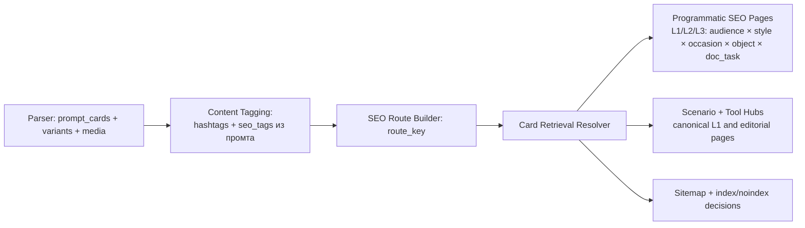

# Архитектура: выдача карточек из БД на SEO-страницы

**Дата:** 11.03.2026  
**Проект:** aiphoto  
**Статус:** implementation-ready (architecture spec)

## Связанные документы (обязательно синхронизировать)

- `07-03-prompt-landing-plan.md` — SEO-дерево, canonical URL и правила index/noindex.
- `10-03-hashtag-extraction-tz.md` — таксономия и правила формирования `seo_tags`.
- `10-03-parser-db-requirements.md` — источник таблиц и контрактов данных.
- `11-03-seo-url-query-mapping-clean.csv` — очищенный рабочий mapping запросов.
- `11-03-seo-url-query-mapping-canonical.csv` — canonical mapping запрос -> URL.
- `11-03-seo-menu-map.csv` — агрегированная карта уникальных SEO URL и menu groups.

---

## 1. Проблема и цель

Есть разрыв между:

1. парсингом контента в БД,
2. тегированием карточек,
3. SEO-роутами сайта.

Нужен единый retrieval-слой, который по route детерминированно выбирает карточки.

Цель:

- на каждом SEO-route показать минимум `2` карточки;
- сохранить максимальную релевантность к route;
- обеспечить стабильную выдачу при одинаковых данных.

---

## 2. Архитектурный контур

`seo_tags` содержит 72 значения в 5 измерениях (из промта). `intent_action` не является тегом карточки и покрывается scenario hubs (`/promty-dlya-sozdaniya-foto/`, `/promty-dlya-obrabotki-foto/` и т.д.). `intent_modifier` и `tool_tag` не записываются в `seo_tags`; tool-запросы живут в отдельном secondary SEO-слое (`/instrumenty/[tool]/`).

`Card Retrieval Resolver` — единая точка отбора карточек для кластерных/programmatic страниц.  
Для индивидуальных карточек (`/p/[slug]/`) используется прямой `getCardBySlug`.  
UI/SSR-рендер не должен выполнять ad-hoc выборку карточек напрямую.

---

## 3. Контракт route_key

Каждая SEO-страница перед выборкой нормализуется в `route_key`:

- `site_lang`: `ru | en` (два сайта, общая БД);
- `audience_tag` (optional);
- `occasion_tag` (optional);
- `style_tag` (optional);
- `object_tag` (optional);
- `doc_task_tag` (optional).

Минимум 1 измерение должно быть задано для programmatic route. Если ни одного — это:
- главная (`/`) с broad intent "из фото в промт";
- scenario hub (`intent_action`, без фильтра по `seo_tags`);
- tool hub (`/instrumenty/[tool]/`, без `seo_tags`-фильтрации).

Требование: одинаковый URL всегда дает одинаковый `route_key`.

---

## 4. Источники и минимальные поля

Используются данные:

- `prompt_cards`: `id`, `source_date`, `parse_status`, `parse_warnings`, `hashtags`, `seo_tags`, `seo_readiness_score`.
- `prompt_variants`: `prompt_text_ru`, `prompt_text_en`.
- `prompt_card_media`: наличие фото.

### seo_tags — content-only (72 значения, 5 измерений)

`seo_tags` содержит только 5 измерений, извлечённых из текста промта:

| Поле seo_tags | Кол-во значений | Примеры |
|---------------|----------------|---------|
| `audience_tag` | 22 | `devushka`, `para`, `s_mamoy`, `s_parnem`, `pokoleniy`, `vlyublennykh` |
| `style_tag` | 18 | `cherno_beloe`, `realistichnoe`, `portret`, `3d`, `gta`, `otkrytka` |
| `occasion_tag` | 7 | `den_rozhdeniya`, `23_fevralya`, `14_fevralya`, `maslenica` |
| `object_tag` | 21 | `v_forme`, `s_mashinoy`, `s_cvetami`, `v_profil`, `zima`, `v_zerkale` |
| `doc_task_tag` | 5 | `na_pasport`, `na_dokumenty`, `na_avatarku`, `na_rezume` |

Полный перечень значений: `10-03-hashtag-extraction-tz.md` (раздел 5.5-5.9).
Рабочий mapping URL → Wordstat: `11-03-seo-url-query-mapping-clean.csv`.
Canonical mapping URL → Wordstat: `11-03-seo-url-query-mapping-canonical.csv`.

### Три типа страниц

| Тип | Как отбираются карточки | Примеры | Кол-во |
|-----|------------------------|---------|--------|
| **Programmatic (L1-L3)** | По `route_key` через `seo_tags` matching | `/promty-dlya-foto-par/cherno-beloe/` | ~72 (L1) + ~2000 (L2) + ~25000 (L3) теор. |
| **Scenario hubs (L1)** | Без фильтра по `seo_tags`, все карточки + editorial blocks | `/promty-dlya-sozdaniya-foto/`, `/promty-dlya-obrabotki-foto/` | ~7 |
| **Tool hubs (secondary L1)** | Без `seo_tags`-фильтра, editorial/tool landing | `/instrumenty/chatgpt/`, `/instrumenty/gemini/` | ~6 |
| **Editorial modifier pages** | Родительский хаб + контентный модификатор | `/promty-dlya-sozdaniya-foto/podrobnye/` | selective |
| **Индивидуальные карточки** | Прямой `getCardBySlug` | `/p/studiynoe-foto-pary/` | N (= кол-во карточек) |

Scenario hubs покрывают intent-кластеры (`intent_action`), tool hubs — generic tool queries, а programmatic-роуты строятся только на 5 content-измерениях.
Индивидуальные карточки всегда `index,follow`.

### Исключение карточки из выдачи

Карточка исключается из выдачи, если:

- нет фото;
- нет языкового варианта для текущего `site_lang`;
- критический `parse_status`/warning (по blacklist проекта).

---

## 5. Алгоритм выдачи (каскад A/B/C)

### 5.1 Обязательное правило объёма

- `min_cards_per_route`:
  - **L1** (1 тег): `>= 3`
  - **L2** (2 тега): `>= 6`
  - **L3** (3 тега): `>= 6`
- Если `cards_count < min`: `noindex` + canonical на родительский L1.

### 5.2 Tier A (строгий)

- must: **все** заданные в `route_key` измерения (`audience_tag`, `style_tag`, `occasion_tag`, `object_tag`, `doc_task_tag`).

### 5.3 Tier B (средний)

- must: хотя бы одно из заданных измерений;
- остальные участвуют в ранжировании.

### 5.4 Tier C (мягкий)

- хотя бы одно любое пересечение по `seo_tags`;
- остальные измерения только в ранжировании.

### 5.5 Merge-правило

- сначала Tier A, затем B, затем C;
- дубликаты запрещены;
- остановка, когда набрали `min_cards_per_route` (или запрошенный limit).

---

## 6. Ранжирование карточек

`relevance_score` (базовая формула):

- `+30` за `audience_tag` совпадение;
- `+20` за `occasion_tag` совпадение;
- `+15` за `style_tag` совпадение;
- `+15` за `object_tag` совпадение;
- `+15` за `doc_task_tag` совпадение;
- `+quality_bonus` за `seo_readiness_score`;
- `+freshness_bonus` за более свежие карточки.

Сортировка:

1. `relevance_score DESC`
2. `source_date DESC`
3. `id ASC` (стабилизация)

---

## 7. Языковая логика RU/EN

- RU сайт: используем карточки с непустым `prompt_text_ru`.
- EN сайт: используем карточки с непустым `prompt_text_en`.
- Фолбэк с RU на EN (или обратно) запрещен для SEO-страниц.

---

## 8. Решение при нехватке карточек

Если после Tier C карточек `< min_cards_per_route`:

- route помечается `noindex`;
- route исключается из sitemap;
- фиксируется метрика `route_insufficient_cards`.

Это правило должно быть синхронно с `07-03-prompt-landing-plan.md`.

---

## 9. API/SQL контракт резолвера

Единый контракт (RPC или сервис):

`resolve_route_cards(route_key, limit, offset, min_cards=2)`

Результат:

- `cards[]`;
- `tier_used`;
- `cards_count`;
- `has_minimum`;
- `debug.score_breakdown` (для админки/диагностики).

---

## 10. Наблюдаемость

Обязательные метрики:

- `routes_total`;
- `routes_with_min_cards`;
- `routes_insufficient_cards`;
- `avg_relevance_score`;
- `tier_distribution (A/B/C)`.

---

## 11. Политика синхронизации документов

При изменении этого документа обязательно ревьюить:

1. `07-03-prompt-landing-plan.md`
   - URL-комбинации route;
   - index/noindex пороги;
   - sitemap правила.
2. `10-03-hashtag-extraction-tz.md`
   - состав SEO-измерений;
   - slug-словарь и названия измерений;
   - минимальный набор тегов для участия карточки в SEO.
3. `10-03-parser-db-requirements.md`
   - наличие необходимых полей в БД;
   - контракты parser -> DB для `seo_tags`, warnings и языковых полей.

---

## 12. Чеклист ревью при правках

- [ ] Поля `route_key` совпадают с SEO-измерениями из `10-03-hashtag-extraction-tz.md`.
- [ ] Правила index/noindex и минимум карточек совпадают с `07-03-prompt-landing-plan.md`.
- [ ] Контракты таблиц/полей подтверждены в `10-03-parser-db-requirements.md`.
- [ ] Нет ad-hoc выборки карточек в UI в обход `resolve_route_cards`.
- [ ] Для RU/EN соблюдено разделение по языковым полям без fallback.
- [ ] `seo_tags` содержит только 5 content-измерений (72 значения: 22+18+7+20+5).
- [ ] Scenario hubs и tool hubs не используют строгий `resolve_route_cards` с фильтрацией по `seo_tags` — показывают все карточки / editorial subset.
- [ ] Индивидуальные карточки (`/p/[slug]/`) используют `getCardBySlug`, не `resolve_route_cards`.
- [ ] min_cards_per_route: L1 >= 3, L2/L3 >= 6.
- [ ] Canonical mapping URL → queries актуален (`11-03-seo-url-query-mapping-canonical.csv`).

