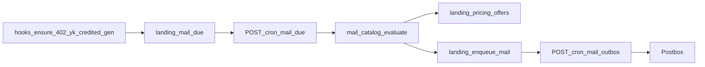

# Целевая картина: lifecycle-почта PromptShot

Ветка реализации: `feature/22-08-lifecycle-mail`.
Транспорт уже в проде: [`docs/21-08-yandex-postbox-mail.md`](21-08-yandex-postbox-mail.md), очередь [`sql/205_landing_mail.sql`](../sql/205_landing_mail.sql), cron `POST /api/cron/mail-outbox`.
Архитектура лендинга: [`docs/architecture/01-landing.md`](architecture/01-landing.md).
Ops: [`docs/ops/yandex-cloud-postbox.md`](ops/yandex-cloud-postbox.md).

Код на ветке `feature/22-08-lifecycle-mail`: `sql/206_landing_mail_lifecycle.sql`, `landing/src/lib/mail-catalog.ts`, cron `POST /api/cron/mail-due`, гранты и вкладка «Каталог». В проде заработает после миграции `206` и cron due рядом с `mail-outbox`.

## 1. Зачем

Новый пользователь стартует с **0 токенов**. Каталог и 10 разборов фото в сутки бесплатные, генерация — после пакета.

Почта закрывает разрывы сайта:

- вошёл и ушёл;
- упёрся в paywall и не купил;
- ушёл на ЮKassa и не оплатил;
- оплатил и не сгенерил;
- токены кончились / затих.

Цель — активация и оплата, не новостная рассылка. Auth-письма GoTrue и 1:1 с `support_ru@promptshot.ru` не трогаем.

## 2. Квота

| Лимит | Значение | Следствие |
|---|---|---|
| Postbox / 24 ч | **5000** | Полные цепочки влезают. Дневной бэкофил win-back на всю базу — нет. |
| Postbox rps | **1 письмо / сек** | Cron outbox уже пауза ≥1.1 с. 5000 писем ≈ 1.5 часа одной очереди. |
| Цена | первые 2000 / мес бесплатно | 5000/сутки ≈ до 150k/мес. Цена не стоп, кампании не каждый день. |
| Allowlist | `POSTBOX_TEST_ALLOWLIST` | Пока задан — в прод-сегменты не слать. |

Квота — потолок **отправки**, не разрешение сканировать всю базу каждый тик.

Резерв суток (`claim_mail_outbox` в `sql/206`):

1. transactional (welcome, токены, abandon, paid_unused);
2. lifecycle marketing (онбординг, no_credits, empty, win-back);
3. ручные кампании `/admin/mail`.

Резерв tx: **500** слотов / сутки `Europe/Moscow`. Кампанию не стартовать, если оставшихся слотов меньше размера сегмента. Win-back: cap **200 sent / сутки** на старте.

## 3. Каталог писем

Никому: гость, `*@promptshot.internal`, hard bounce / complaint. Marketing ещё режется отпиской.

`canceled` — не отдельное письмо. Для кассы это тот же незакрытый checkout, что `created` / `pending`. Отдельных писем Robokassa нет (грант на checkout Robokassa применяется, если жив).

Колонка `exploring` в БД не хранится. Состояние считается из фактов в момент due.

### 3.1 Регистрация и активация

| id | Класс | Кому | Когда | Стоп | Скидка | CTA | Ключ |
|---|---|---|---|---|---|---|---|
| `welcome` | tx | первый `ensureLandingUser` с email | сразу | уже слали | нет | каталог + что бесплатно + `/pricing` | `welcome:{user}` |
| `onboard_d1` | mkt | 0 ген, 0 credited, нет строки ЮKassa | +1 сутки после welcome | ген / любой платёж / отписка | нет | `/generaciya-foto` | `onboard_d1:{user}` |
| `onboard_d3` | mkt | всё ещё так | +3 суток | то же | нет | один промт + Пробный | `onboard_d3:{user}` |
| `onboard_d7` | mkt | всё ещё так | +7 суток | то же | **20%**, 7 дней | `/pricing` | `onboard_d7:{user}` |
| `analyze_intent` | mkt | есть `analyze_history`, 0 ген, 0 оплаты | +6 ч после первого разбора | ген / платёж | нет | разбор → генерация | `analyze_intent:{user}` |
| `no_credits` | mkt | серверный отказ платной генерации или 11-го разбора, платежа нет | +2 ч | строка платежа / credited | нет | `/pricing`, Пробный | `no_credits:{user}` |

`welcome` переписать, не плодить второе «привет». Триггер остаётся первый product-вызов (generate / analyze / checkout / attribution), не голый OAuth.

`no_credits` **не** про баланс 0. У нового аккаунта токенов и так нет.

- Не шлём: каталог, копия промта, 10 бесплатных разборов → `welcome` / `onboard_*` / `analyze_intent`.
- Шлём один раз: нажал «Сгенерировать» (или 11-й разбор) → paywall → ушёл → через 2 ч нет create payment.
- Ушёл в ЮKassa за эти 2 ч → abandon, не это письмо.
- После любой оплаты письмо мертво. Повторный 0 у платящего → `credits_empty`.

### 3.2 Касса (только ЮKassa)

Часы от `created_at` платежа. Статусы `created` / `pending` / `canceled` одинаковы. Стоп: любой `credited_at`. CTA: `/pricing?plan={plan_id}`, не `confirmation_url`.

| id | Класс | Когда | Скидка | Ключ |
|---|---|---|---|---|
| `yk_abandon_40m` | tx | +30–40 мин, нет credited | **10%** (не понижать живые 20%) | `yk_abandon_40m:{payment_id}` |
| `yk_abandon_24h` | tx | +24 ч, всё ещё нет credited | **20%** | `yk_abandon_24h:{payment_id}` |

Новая строка платежа — новые due на её `created_at`. Старые ключи по старому `payment_id` не дублируем.

### 3.3 После оплаты

| id | Класс | Когда | Скидка | Стоп | CTA | Ключ |
|---|---|---|---|---|---|---|
| `tokens_credited` | tx | fulfill `credited === true` | нет | ключ платежа | `/generaciya-foto` | `{provider}_credited:{payment_id}` |
| `paid_unused` | tx | credited, 0 генераций, +24 ч | **нет** | первая генерация | `/generaciya-foto` | `paid_unused:{user}` |
| `credits_empty` | mkt | был paid, credits=0, ген < 7 дней, новой оплаты нет | нет | новый credited | `/pricing` | `credits_empty:{user}:{yyyy-mm-dd}` |
| `winback_14` | mkt | была генерация, тишина ≥ 14 дней | **10%**, 7 дней | новая ген | `/pricing` | `winback_14:{user}:{cycle}` |
| `winback_30` | mkt | ≥ 30 дней и 14-дневное уже ушло | **20%**, 7 дней | новая ген | `/pricing` | `winback_30:{user}:{cycle}` |
| `campaign` | mkt | ручной send | нет | отписка / уже было mkt сегодня | из тела | `campaign:{id}:{email}` |

`credits_empty` — не чаще раза в 14 дней. Win-back цикл не крутить каждое утро: due ставится в момент генерации (`last_gen+14d` + jitter), не ночным full-scan.

Коллизия в один тик (одно письмо): checkout → unused → empty → no_credits/analyze → onboard → win-back → кампания.

Marketing ≤ 1 письмо / календарные сутки `Europe/Moscow`. Transactional в тот же день можно.

### 3.4 Черновики смысла

| id | Тема | Смысл |
|---|---|---|
| `welcome` | Добро пожаловать в PromptShot | Каталог и промты бесплатно. 10 разборов фото в сутки. Генерация — пакет, самый маленький «Пробный». |
| `onboard_d1` | Как сделать первое фото | Карточка → своё фото → пакет, если нет токенов. |
| `onboard_d3` | Промт, с которого обычно начинают | Одна закреплённая карточка, не витрина. |
| `onboard_d7` | −20% на пакеты PromptShot | 7 дней, все пакеты, войти тем же аккаунтом. |
| `analyze_intent` | Разбор готов — осталось фото | Промт из фото уже есть. Следующий шаг — генерация. |
| `no_credits` | Не хватило токенов | Генерация ждала оплаты. Пробный пакет. |
| `yk_abandon_40m` | Оплата не завершена | Платёж начат, токены не начислены. Закончить на сайте, −10%. |
| `yk_abandon_24h` | Пакет ещё можно оплатить | То же, −20%, без давления. |
| `tokens_credited` | Токены зачислены | Пакет, число токенов, сразу «сделать фото». |
| `paid_unused` | Токены ждут первую генерацию | Оплата прошла, генераций нет. |
| `credits_empty` | Токены закончились | Короткий повтор. |
| `winback_14` | Новый промт на PromptShot | Одна карточка, −10%. Не «мы скучаем». |
| `winback_30` | Вернуться к генерации | Один CTA, −20%. |

Подпись:

```
—
Команда PromptShot
https://promptshot.ru
```

Имена пакетов в копирайте — текущий treatment: **Пробный 99 ₽ / 30**, Оптимальный 299 / 100, Большой 469 / 200, Максимум 990 / 500. `plan_id`: `trial` / `start` / `pro` / `max`.
`MAIL_PLAN_LABELS`: Пробный / Оптимальный / Большой / Максимум.

## 4. Персональные скидки

Промокода нет. Цена только серверная: `getPricingPlan` → `amount_rub`. Клиент шлёт только `planId`.

Письмо с процентом **не enqueue**, пока грант не записан и checkout/UI не умеют его применить.

| Письмо | % | Срок гранта |
|---|---|---|
| `onboard_d7` | 20 | 7 дней с отправки |
| `yk_abandon_40m` | 10 | 7 дней; не понижать живые 20% |
| `yk_abandon_24h` | 20 | 7 дней; апгрейд с 10% |
| `paid_unused` | нет | — |
| `winback_14` | 10 | 7 дней |
| `winback_30` | 20 | 7 дней; апгрейд с 10% |

Цены (floor):

- 10%: 99→89, 299→269, 469→422, 990→891
- 20%: 99→79, 299→239, 469→375, 990→792

Токены пакета не меняются. CTA писем со скидкой: `https://promptshot.ru/pricing`. Гость и чужой аккаунт — полные цены. Пересланное письмо скидку не даёт.

## 5. Реализация (не сканер)

Факты в БД — SSOT. В момент события планировщик ставит или снимает **due**. Cron трогает только просроченные строки. Send — тот же `landing_enqueue_mail`.



Не делать: cron, который каждый тик джойнит users × generations × payments × analyze. На 100k+ это упрётся в Postgres и конкурирует с generate.

### 5.1 Таблицы (следующая миграция после `sql/205`)

`landing_mail_due`

- `id`, `shared_user_id`, `template_id`, `subject_key` (user id / `payment_id` / …), `due_at`, `payload`, `status` (`scheduled` / `claimed` / `done` / `cancelled`)
- unique `(template_id, subject_key)`
- index `(due_at)` where `scheduled`
- claim: `FOR UPDATE SKIP LOCKED`, как outbox

`landing_pricing_offers`

- один **живой** грант на пользователя: unique partial index `shared_user_id` where `consumed_at is null` and `expires_at > now()`
- `offer_id`, `percent`, `expires_at`, `consumed_at`, `reserved_payment_id`
- upsert: больший % побеждает, меньший не затирает; expiry 7 дней с записи

`landing_mail_credit_blocks` (или эквивалент)

- факт 402: `shared_user_id`, `created_at`, уникальный unpaid-ключ
- due `no_credits` = этот факт + 2 ч; не выводить из `credits = 0`

### 5.2 Хуки (писать due, не SMTP)

- Welcome enqueue успешен → due `onboard_d1/d3/d7` на +1/+3/+7d. Если уже есть analyze — каталог может поставить `analyze_intent` +6 ч вместо d1.
- Первый успешный analyze, 0 оплаты → due `analyze_intent` +6 ч.
- 402 generate / платный analyze → факт + due `no_credits` +2 ч. Не из Метрики.
- Create ЮKassa → cancel exploring / analyze / no_credits due; due `yk_abandon_40m` +40 мин и `yk_abandon_24h` +24 ч на этот `payment_id`.
- Новый ЮKassa payment → cancel abandon по старому незачисленному `payment_id`.
- `credited` (существующие fulfill RPC) → как сейчас `tokens_credited`; cancel все unpaid due; due `paid_unused` +24 ч; **`consumed_at` гранта в той же транзакции, что fulfill**.
- Первая `landing_generations` completed → cancel `paid_unused` и весь onboard.
- Списание в 0 после paid → due `credits_empty` (не чаще 14 дней — проверяет catalog).
- Completed generation → due `winback_14` = `last_gen+14d` + `hash(user) % 24h` jitter; после отправки 14 — due 30. Не ночной batch по всей базе.
- Credited / отписка / suppress → cancel соответствующих mkt due.

Cron `POST /api/cron/mail-due` (`CRON_SECRET`): claim пачку due → `mailCatalog.evaluate(facts)` на **одного** user → enqueue или skip → done / next due / cancelled. Generate SMTP не ждёт.

### 5.3 Outbox: приоритет и бюджет

Сейчас claim FIFO: кампания на 3k адресов забьёт ≈50 мин и сдвинет abandon.

Целевой `landing_mail_claim`:

- порядок: `transactional` → lifecycle marketing → `campaign`;
- суточный счётчик sent `Europe/Moscow`; резерв tx 500;
- `landing_mail_campaign_enqueue` не стартовать, если `remaining < recipient_count`;
- win-back: jitter + cap 200 sent/сутки.

`kind`: lifecycle mkt = `marketing` (отписка). Abandon / tokens / welcome / paid_unused = `transactional`.

### 5.4 Грант на кассе

Create ЮKassa и Robokassa: `SELECT … FOR UPDATE` живого гранта → `amount_rub = floor(catalog * (100-percent)/100)` → `offer_id` + `reserved_payment_id`. Один открытый discounted-платёж. `canceled` снимает reserve, грант жив до expiry.

`GET /api/me` отдаёт `{ offer: { percent, expiresAt } | null }`. `PricingCards` рисует зачёркнутый каталог. Гость — полные цены.

### 5.5 mail-catalog — SSOT

Модуль `landing/src/lib/mail-catalog.ts`:

- id, class, delay, stop-предикаты, percent, CTA, idempotency key, fixture для превью;
- due-cron и админка импортируют его;
- тексты — расширенный `renderMailTemplate`;
- админка не копирует прозу из этой спеки вручную.

## 6. Админка: вкладка «Каталог»

`/admin/mail` — **две вкладки**, тот же admin allowlist.

**Кампании** — как сейчас.

**Каталог** — одно место, где видно каждое письмо продукта:

- список id: `welcome`, `onboard_d1`, `onboard_d3`, `onboard_d7`, `analyze_intent`, `no_credits`, `yk_abandon_40m`, `yk_abandon_24h`, `tokens_credited`, `paid_unused`, `credits_empty`, `winback_14`, `winback_30`, `campaign`;
- для выбранного из `mail-catalog.ts`: класс (tx/mkt), кому, когда, стоп, скидка %, CTA, ключ;
- превью темы + HTML/текст из того же `renderMailTemplate`, что уходит в Postbox, на fixture (имя, `plan_id`, credits, цена до/после скидки). Не отдельный макет в Markdown.

Превью **не шлёт** почту. «На свой email» — позже, через outbox + `POSTBOX_TEST_ALLOWLIST`.

## 7. Наблюдаемость

Не строим open-rate.

В ответ cron due/outbox и admin stats: sent/skip/fail по `template_id`, backlog due, duration cron, остаток квоты, offer applied/consumed.

SLO (когда код появится):

- tx p95 outbox → sent < 5 мин при живом Postbox;
- abandon 40m уходит в окне 40–55 мин.

Отказ Postbox — очередь копится, generate идёт. Нет гранта — полная цена, письмо со скидкой не ставить.

## 8. Порядок кода после этой спеки

Каждая поставка — код + тесты + строка в architecture в одном коммите. Ветка та же: `feature/22-08-lifecycle-mail` от `origin/main` (или свежий checkout, если ветка уже уехала).

1. `mail-catalog` (сначала на живых welcome/tokens) + вкладка «Каталог» в `/admin/mail`.
2. `landing_mail_due` + cron due + хук welcome → onboard due (d1 ещё можно не слать).
3. Приоритетный claim outbox + дневной бюджет + стоп кампании без слотов.
4. `landing_pricing_offers` + create/fulfill ЮKassa/Robokassa + `/api/me` + PricingCards. Без этого ни одного письма со скидкой.
5. Хуки ЮKassa → abandon 40m/24h + гранты 10/20.
6. `paid_unused` due от credited.
7. Onboard d1/d3/d7 + `analyze_intent`; d7 только с грантом 20%.
8. Факт 402 → `no_credits`.
9. `credits_empty`.
10. Win-back 14/30 (jitter + cap 200) + сегменты админки (`exploring`, `paid_active`, `paid_quiet`, `empty`, `trial_only`).
11. Редакционные кампании под новый бюджет.

## 9. Приёмка целевой картины

- `exploring` получает не больше welcome + 3 onboard и замолкает после ген или платежа.
- ЮKassa без зачисления: максимум 2 abandon (`created|pending|canceled`), CTA на `/pricing?plan=`.
- `no_credits` только после серверного 402, не из нулевого баланса.
- Marketing не чаще 1/сутки и не после unsubscribe.
- Кампания на `all_email` не съедает сутки так, что токены/abandon стоят в очереди.
- Письмо со скидкой не уходит без живого гранта; checkout считает цену на сервере.
- Гости и `@promptshot.internal` не получают ничего.

## 10. Вне скоупа

- Письма Telegram-бота.
- Чеки ЮKassa / «Мой налог».
- Hard opt-in чекбокс (152-ФЗ) — отдельное решение, не блокер transactional.
- A/B тем в v1.
- ESP, второй Docker mail-worker, open-rate.
