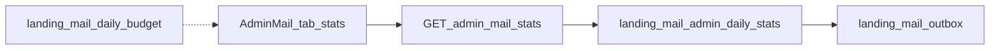

# Требования: статистика отправок по дням в `/admin/mail`

Ветка реализации: `feature/22-08-mail-admin-daily-stats` (от `origin/main`).
Транспорт и очередь: [`docs/21-08-yandex-postbox-mail.md`](21-08-yandex-postbox-mail.md), [`docs/22-08-lifecycle-mail.md`](22-08-lifecycle-mail.md).
Архитектура лендинга: [`docs/architecture/01-landing.md`](architecture/01-landing.md).
Ops: [`docs/ops/yandex-cloud-postbox.md`](ops/yandex-cloud-postbox.md).

Это спека UI/API. Код писать только после checkout этой ветки. Миграции `205` / `206` не менять.

## 1. Зачем

Админка показывает снимок очереди: pending / sent (накопительно за всё время) / skipped / failed / due_ready / остаток квоты сегодня. Не видно, **сколько каких писем ушло за день**.

Нужно за 2 секунды ответить: что отправили сегодня и вчера, не упираемся ли в 5000/сутки. Не сканер пользователей, не открываемость, не Metrika.

## 2. Допущения

- День = `Europe/Moscow`, функция `landing_mail_moscow_day` (уже есть).
- Факт отправки = `landing_mail_outbox.status = 'sent'` и `sent_at`. Не `created_at` (письмо могло лежать в pending с утра).
- Skip / fail = `status IN ('skipped','failed')` и день от `updated_at`.
- Окно по умолчанию **14 суток**, максимум **30**.
- `queued` и `remaining` имеют смысл **только для сегодня**: pending + processing едят слоты квоты. В прошлые дни `queued = 0`, `remaining = null`.
- Индекса по `sent_at` сейчас нет. Rollup-таблица в v1 не нужна: 5k sent/сутки × 30 дней ≈ 150k строк.

## 3. Вне скоупа (v1)

- Графики, CSV, unique recipients, сравнение неделя к неделе.
- Сырые email, `user id`, payload в JSON.
- Open / click / репутация Postbox.
- Ручной resend, правка квоты из UI.
- Отдельная rollup-таблица (`landing_mail_stats_daily`) — только если p95 RPC > 500 ms на 90 днях или окно просят «за год».
- Менять cron `mail-outbox` / `mail-due`.

## 4. Архитектура

```
Admin GET /api/admin/mail/stats?days=14
        → RPC landing_mail_admin_daily_stats(p_from date, p_to date)
        → GROUP BY moscow_day, template_id, kind, status
AdminMailDashboard вкладка «Статистика»
```

SSOT — outbox. Due не сканировать. Бюджет сегодня должен сходиться с `landing_mail_daily_budget().sent` (расхождение = 0).



## 5. API

`GET /api/admin/mail/stats?days=14`

- Тот же `requireAnalyticsAdmin`, что кампании.
- `days` ∈ [1, 30], default 14. Иначе 400.
- `Cache-Control: no-store`.
- Только GET, без side effects.
- RPC: `service_role` only, не выдавать `authenticated`.

Ответ:

```json
{
  "timezone": "Europe/Moscow",
  "from": "2026-08-09",
  "to": "2026-08-22",
  "cap": 5000,
  "days": [
    {
      "day": "2026-08-22",
      "sent": 11,
      "skipped": 0,
      "failed": 0,
      "queued": 74,
      "remaining": 4915,
      "by_template": [
        {
          "template_id": "welcome",
          "kind": "transactional",
          "sent": 8,
          "skipped": 0,
          "failed": 0
        }
      ]
    }
  ]
}
```

Правила агрегации:

| Поле | Как считать |
|---|---|
| `day` | `landing_mail_moscow_day(sent_at)` для sent; `landing_mail_moscow_day(updated_at)` для skip/fail |
| `sent` / `skipped` / `failed` | count по статусу в этот день |
| `by_template` | те же count, ключ `template_id` + `kind` |
| нули | шаблоны без событий не отдавать |
| сортировка | дни DESC; внутри дня — `sent` DESC |
| `queued` / `remaining` | только строка сегодняшнего дня; как `landing_mail_daily_budget` |

`template_id` — только id из `MAIL_TEMPLATE_IDS` (`mail-templates.ts`).

## 6. SQL

Новая миграция со следующим номером после актуального в `sql/` (не править `205` / `206`).

Индекс:

```sql
CREATE INDEX idx_landing_mail_outbox_sent_at
  ON public.landing_mail_outbox (sent_at DESC)
  WHERE status = 'sent';
```

При необходимости второй:

```sql
CREATE INDEX idx_landing_mail_outbox_skip_fail_at
  ON public.landing_mail_outbox (updated_at DESC)
  WHERE status IN ('skipped', 'failed');
```

RPC `landing_mail_admin_daily_stats(p_from date, p_to date)`:

- если `p_from` / `p_to` null, `p_from > p_to`, или окно > 30 суток — `P0001`;
- читает только `landing_mail_outbox`;
- не джойнит `auth.users`.

## 7. UI

Третья вкладка на `/admin/mail`: **Каталог** / **Кампании** / **Статистика**.

- Строка на день: дата, sent, skip, fail; для сегодня ещё queued и «остаток / 5000».
- Раскрытие дня → таблица template × sent / skip / fail.
- Без графиков и без клика в конкретный адрес.
- Ошибка загрузки: текст «не загрузилось», очередь внизу страницы не ломать.

## 8. Нагрузка и SLO

| | |
|---|---|
| Пик outbox | 5000 sent / сутки |
| Окно v1 | ≤ 150k sent-строк / 30 дней |
| Админ | единицы RPS |
| Latency | p95 RPC < 300 ms на 14 днях при < 200k sent-строк |
| Доступность | падение stats не блокирует cron и отправку |
| Точность | `days[today].sent` = `landing_mail_daily_budget().sent` |

Допустимо: skip/fail по `updated_at` чуть плывут, если строку трогали руками.

Оперативный сигнал по-прежнему не эта вкладка, а `oldest_pending_at` > 15 мин при pending > 0.

Что сломается первым без индекса: seq scan outbox, когда история > 0.5–1M строк.

## 9. Безопасность

- Только `ANALYTICS_ADMIN_EMAILS`.
- В JSON нет email, user id, payload, секретов.
- Не логировать PII.
- Cron и Postbox-ключи эта страница не читает.

## 10. Тесты

- Письмо с `created_at` вчера и `sent_at` сегодня попадает в **сегодня**.
- `queued` не попадает в прошлые дни.
- `days > 30` → 400.
- Сегодняшний `sent` сходится с бюджетом.
- Не-admin → 401 / 403.

## 11. Приёмка

На `/admin/mail` → Статистика за сегодня видны те же sent по каждому `template_id`, что в SQL:

```sql
SELECT template_id, count(*)
FROM public.landing_mail_outbox
WHERE status = 'sent'
  AND public.landing_mail_moscow_day(sent_at)
      = public.landing_mail_moscow_day(now())
GROUP BY 1;
```

Шапка очереди (pending / sent / due ready) не ломается. Cron не зависит от этой страницы.

## 12. Эволюция

1. Миграция индекса + RPC.
2. `GET /api/admin/mail/stats` + вкладка.
3. Обновить `docs/architecture/01-landing.md` в том же PR (маршрут, RPC, вкладка).
4. Позже, отдельный spec: CSV, unique recipients, WoW, rollup.

## 13. Чеклист реализации

- [x] Ветка `feature/22-08-mail-admin-daily-stats` от `origin/main`
- [x] SQL: индекс + `landing_mail_admin_daily_stats`
- [x] `GET /api/admin/mail/stats`
- [x] Вкладка «Статистика» в `AdminMailDashboard`
- [x] Тесты агрегации и 400 на окно
- [x] `docs/architecture/01-landing.md` в том же коммите
