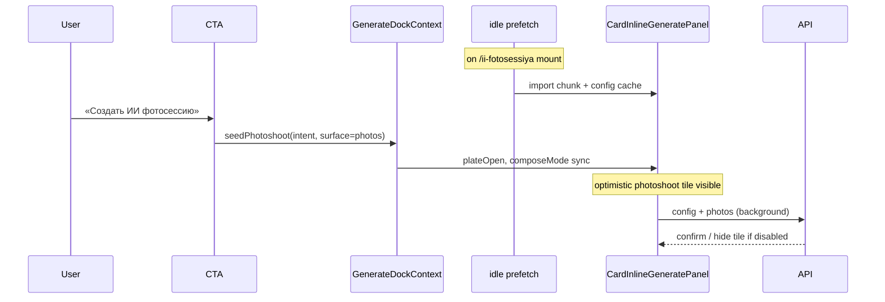

# Мгновенное открытие инструментов в generate dock

> **Дата:** 2026-08-31  
> **Статус:** реализовано (P0+P1); P2 split hydrate — follow-up  
> **Ветка:** `feature/31-08-generate-dock-instant-compose`  
> **Роль:** `@high-scale-architect`  
> **Связано:** `docs/31-08-ii-fotosessiya.md`, `docs/30-08-foto-v-promt-generation-modal.md`, `docs/architecture/01-landing.md`

Дополнительный сценарий из `feature/30-08-fotosessii-compose-default`: чип **«ИИ фотосессия»**, гость без фото — **«Загрузите фото»**, enqueue из одного library-фото без parent (`sql/230_photoshoot_from_library.sql`), idle intent/CTA на legacy `/promty-dlya-ii-fotosessii*` как на `/ii-fotosessiya*`.

---

## 1. Проблема

Пользователь на лендингах **ИИ фотосессия** (`/ii-fotosessiya*`) и **Фото в промт** (`/foto-v-promt`) жмёт CTA («Создать ИИ фотосессию», «Загрузить фото», таб «Создать промт по фото») и ожидает **сразу** открытый модуль генерации с уже выбранным инструментом.

Фактически:

1. Сначала skeleton «Загружаем генератор» или пустая пластина.
2. Затем режим «Фото» вместо «Фотосессия» / «Промт по фото» (FOUC).
3. Шторка «Ваши фото» не открывается, хотя пользователь пришёл загрузить фото.
4. После появления UI — спиннер библиотеки до завершения hydrate.

Intent в `GenerateDockContext` ставится мгновенно; **UI режима отстаёт** на 300–1500 ms и иногда показывает неверный режим.

---

## 2. Текущая архитектура (as-is)

### 2.1 Слои задержки

| # | Слой | Где | Эффект |
|---|---|---|---|
| 1 | **Lazy-load панели** | `GenerateListingDockHost` → `dynamic()` `CardInlineGeneratePanel` | Чанк грузится только после `plateOpen`; skeleton до mount |
| 2 | **Fat hydrate** | `CardInlineGeneratePanel` mount: `Promise.all` config, video config, photos, prefs, me, generations | `libraryLoading=true` до ответов API; шторка «Ваши фото» — спиннер |
| 3 | **Feature flag с сервера** | `photoshootEnabled` из `GET /api/generation-config`; init = `readCachedPhotoshootEnabled()` | Без кеша плитка «Фотосессия» скрыта, хотя `composeMode=photoshoot` |
| 4 | **Intent ≠ surface** | `seed.intent` vs `dockSurface` | `photoshoot` / `photo_prompt` не открывают шторку фото без явного `dockSurface: "photos"` |

### 2.2 Продуктовый контракт (2026-08-29)

Из `docs/architecture/01-landing.md`:

- Плитка **«Фотосессия»** — только выбор режима (`aria-pressed`), **без** авто-шторки и overlay.
- Плитка **«Промт по фото»** — шторка «Ваши фото» по **клику** на плитку, не при seed intent.

### 2.3 Текущее поведение CTA

| Вход | `seed.intent` | `dockSurface` | Что видит пользователь |
|---|---|---|---|
| Mobile tab «Создать ИИ фотосессию» | `photoshoot` | `null` | Док + подсветка «Фотосессия» (после config), без листа фото |
| HowTo «Загрузить фото» (хаб) | `photoshoot` | `photos` | Док + лист фото (спиннер до hydrate) |
| Tab / FAB на `/foto-v-promt` | `photo_prompt` | `null` | Подсветка «Промт по фото», шторка закрыта |
| Загрузка файла на `/foto-v-promt` | `photo_prompt` | in-memory photo | Analyze стартует, если есть data URL |

### 2.4 Ключевые файлы

| Область | Файл |
|---|---|
| Контекст / seed | `landing/src/context/GenerateDockContext.tsx` |
| Lazy host | `landing/src/components/generate/GenerateListingDockHost.tsx` |
| Панель compose | `landing/src/components/CardInlineGeneratePanel.tsx` |
| Intent по path | `landing/src/lib/generate-dock-path.ts` |
| Seed types | `landing/src/lib/generate-dock-seed.ts` |
| Pending / auth return | `landing/src/lib/generate-dock-pending.ts`, `auth-return-screen.ts` |
| Mobile tab | `landing/src/components/MobileTabBar.tsx` |
| HowTo CTA | `landing/src/components/fotosessii/PromtyDlyaIiFotosessiiLandingSections.tsx` |

---

## 3. Целевое поведение (to-be)

### 3.1 Общие требования

1. **Perceived instant:** с первого кадра после открытия plate пользователь видит **правильный выбранный инструмент** (плитка с `aria-pressed`), без промежуточного «Фото».
2. **Route-aware entry:** вход с `/ii-fotosessiya*` → режим «Фотосессия»; с `/foto-v-promt` → «Промт по фото»; без ручного переключения.
3. **Upload-first flows:** CTA с семантикой «загрузить фото» открывает **шторку «Ваши фото»** в том же жесте (HowTo, tab на fotosessii — по продуктовому решению, см. §3.3).
4. **Graceful loading:** пока hydrate идёт — skeleton **внутри** уже выбранного режима (не смена режима после загрузки).
5. **Feature off:** если `photoshoot_enabled=false` в config — плитка скрывается **после** ответа API; до ответа на fotosessii-роутах допустим optimistic UI с последующим скрытием.

### 3.2 Нефункциональные

| Метрика | Цель |
|---|---|
| Time to correct compose chrome | ≤ 100 ms после mount панели (sync из seed) |
| Time to visible tile «Фотосессия» на fotosessii | ≤ 100 ms (optimistic); подтверждение config — фоном |
| Доп. запросы на landing | Prefetch config допустим **один раз** за сессию на кластерных URL |
| Bundle | Eager prefetch чанка панели — только на listing-path с generate dock |

### 3.3 Продуктовые решения (зафиксировать до реализации)

| Вопрос | Вариант A (рекомендуется) | Вариант B (as-is) |
|---|---|---|
| Tab «Создать ИИ фотосессию» открывает лист фото? | Да, `dockSurface: "photos"` | Нет, только подсветка «Фотосессия» |
| Tab «Создать промт по фото» открывает лист фото? | Да | Нет, только подсветка «Промт по фото» |
| Клик по плитке «Фотосессия» внутри dock | Только toggle режима (без шторки) | Без изменений |

**Рекомендация:** вариант A для **внешних** CTA (tab, HowTo, hero); внутри dock — без изменений (клик по плитке = только режим).

---

## 4. Технические требования к реализации

### 4.1 P0 — без новых API

1. **Sync compose from seed** — `composeMode` и `aria-pressed` на плитках инициализируются из `seed.intent` **до** `generation-config` (уже частично есть для `photoshoot` / `photo_prompt`).
2. **Optimistic `photoshootEnabled`** — на path prefix `/ii-fotosessiya` считать `photoshootEnabled=true` до ответа config; после ответа — authoritative value + `writeCachedPhotoshootEnabled`.
3. **Intent → default surface для внешних CTA** — маппинг в `seedPhotoshoot` / `seedPhotoPrompt` / `focusBlank` для listing fotosessii и foto-v-promt:
   - `photoshoot` + entry `tab` | `howto` | `hero` → `dockSurface: "photos"`
   - `photo_prompt` + entry `tab` | `fab` → `dockSurface: "photos"`
4. **Не remount без нужды** — смена только `dockSurface` не должна инкрементить `seedToken`, если intent тот же.

### 4.2 P1 — prefetch

1. На mount страниц `/ii-fotosessiya*`, `/foto-v-promt` — `import("@/components/CardInlineGeneratePanel")` в `requestIdleCallback` / после LCP.
2. Тот же prefetch — `GET /api/generation-config?modality=image` с записью `photoshoot-enabled` в sessionStorage.
3. На любом listing-dock — `GET /api/user-generation-photos` в тот же idle-слот (`prefetchUserPhotoLibrary`): sessionStorage + decode preview. Шторка «Ваши фото» открывается с уже лежащими на фронте превью; гид (`photo-guide-portrait.webp`) и ряд «Добавить» + «Готово» прибиты вниз с первого кадра и не прыгают, когда hydrate догоняет.

### 4.3 P2 — split hydrate

1. **Phase 1 (blocking UI):** config flags + compose chrome из seed.
2. **Phase 2 (background):** library photos, preferences, last generation — шторка показывает skeleton списка, не блокирует выбор режима.

### 4.4 Явно не делать

- Не включать фичи через env (`photoshoot_enabled` только из БД).
- Не блокировать открытие dock auth-ом (гость видит инструменты).
- Не писать ephemeral photo data в sessionStorage.

---

## 5. Acceptance criteria

### 5.1 ИИ фотосессия

- [x] Mobile tab «Создать ИИ фотосессию» на `/ii-fotosessiya`: plate открыт, плитка «ИИ фотосессия» pressed с первого кадра панели.
- [x] HowTo «Загрузить фото»: шторка «Ваши фото» открыта (гид + низ сразу; превью из cache, не skeleton).
- [x] Нет FOUC «Фото» → «ИИ фотосессия» при cold load без sessionStorage cache.
- [x] При `photoshoot_enabled=false` плитка исчезает после config; CTA на лендинге ведёт в fallback (текст/скрытие — отдельная задача).

### 5.2 Фото в промт

- [x] Tab «Создать промт по фото» на `/foto-v-promt`: плитка «Промт по фото» pressed с первого кадра.
- [x] Шторка «Ваши фото» открыта при входе с tab (вариант A §3.3).
- [x] Загрузка файла с лендинга по-прежнему стартует analyze без регрессии.

### 5.3 Регрессии

- [x] `/generaciya-foto`, `/`, `/trends` — blank dock и `intent=resume` без изменений.
- [x] Card «Повторить» — `seedFromCard`, не photoshoot/photo_prompt.
- [x] Тесты: `generate-dock-seed.test.ts`, `generate-dock-path.test.ts`, `generate-dock-pending.test.ts` обновлены.
- [x] После `done` tab/FAB на `/ii-fotosessiya*` показывают последний кадр, не пустую шторку «Ваши фото». `lastDockResult` в контексте; dismiss только X / «Повторить» / delete.

### 5.4 Compose-default (влито)

- [x] Чип и rail: «ИИ фотосессия»; гость без фото — «Загрузите фото».
- [x] Legacy `/promty-dlya-ii-fotosessii*` держит тот же idle intent/CTA, что `/ii-fotosessiya*`.
- [x] `landing_enqueue_generation` принимает photoshoot без parent при ровно одном `input_photo_paths` (SQL `230`).

---

## 6. Sequence (target)

---

## 7. Обновление архитектурной доки

После реализации обновить `docs/architecture/01-landing.md`:

- блок global listing generate dock — prefetch + optimistic compose;
- контракт «Фотосессия» — различие внешний CTA vs клик по плитке внутри dock;
- дата «Последнее обновление».

---

## 8. Out of scope

- Eager bundle для всего лендинга (только listing-path dock).
- Серверный SSR config в RSC (отдельная оптимизация).
- Изменение цен, моделей, worker pipeline фотосессии.
