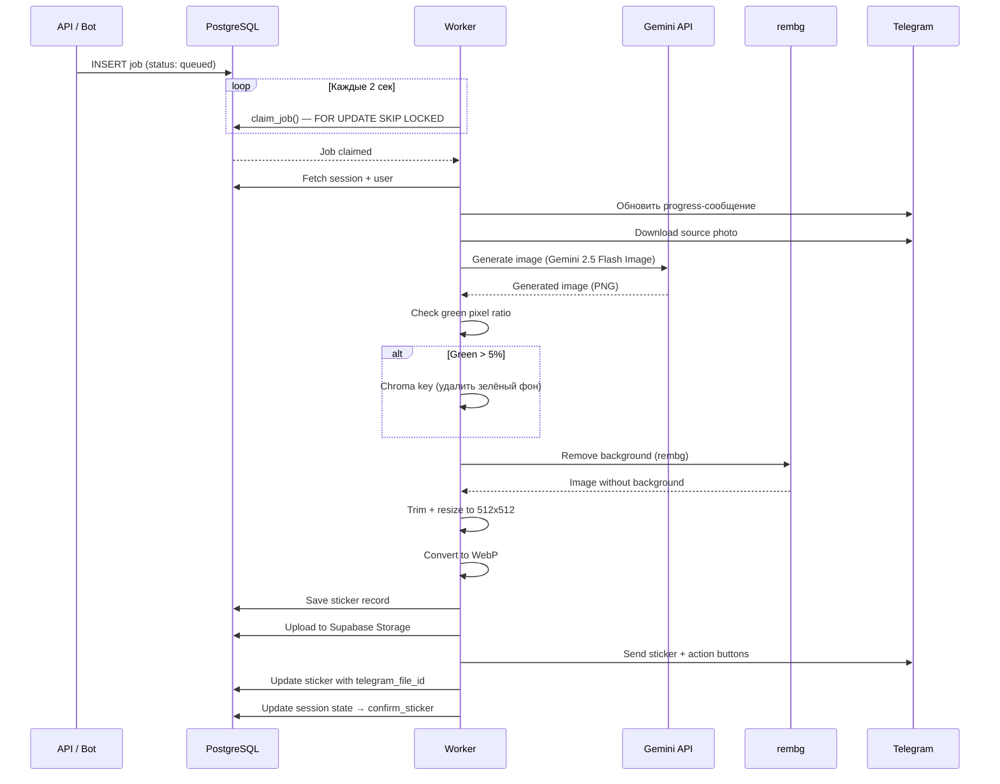
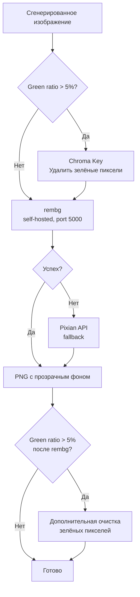

# Worker — `src/worker.ts`

Фоновый процесс, который обрабатывает задания на генерацию стикеров.
Работает отдельным Docker-контейнером, поллит очередь заданий из PostgreSQL.

## Принцип работы

## Пайплайн генерации

### 1. Получение задания
- `claim_job(worker_id, env)` — RPC-функция с `FOR UPDATE SKIP LOCKED`
- Предотвращает двойную обработку при нескольких воркерах
- Worker ID: `photo2sticker-{env}-worker-{N}-{timestamp}`

### 2. Подготовка
- Загрузка сессии и пользователя из БД
- Определение типа генерации (`style`, `emotion`, `motion`, `text`)
- Обновление progress-сообщения: "⏳ Генерирую стикер..."

### 3. Скачивание исходного фото
- Источник: `session.current_photo_file_id` (Telegram file_id)
- Скачивание через Telegram Bot API → Buffer

### 4. Генерация изображения (Gemini)
- Модель: `gemini-2.5-flash-image`
- Входные данные: исходное фото + промпт
- Промпт содержит:
  - Инструкцию по стилю (из style preset или кастомный)
  - Требование зелёного фона `#00FF00`
  - Требования к композиции (не обрезать, оставить padding)
  - Требования к качеству (без водяных знаков, текста и т.д.)
- Retry с exponential backoff (3 попытки)

### 5. Модерация контента
- Проверка на blocked content от Gemini
- Если заблокировано — уведомление пользователю + alert

### 6. Удаление фона

**rembg** (основной):
- Self-hosted сервис на `http://p2s-rembg:5000`
- Модель: isnet-general-use (ранее u2net — обновлено 2026-02-13)
- Изображение ресайзится перед отправкой (экономия трафика)
- 2 попытки
- Health check перед каждым запросом

**Pixian** (fallback):
- Внешний API (pixian.ai)
- Используется если rembg недоступен или упал
- Авторизация через username/password

### 7. Финализация изображения
- Trim пустого пространства (sharp)
- Resize до 512x512 (вписать, сохранить пропорции)
- Конвертация в WebP

### 8. Сохранение и отправка
- INSERT в `stickers` таблицу
- Upload в Supabase Storage (`stickers` bucket)
- Отправка стикера через Telegram API
- Обновление `telegram_file_id` на записи стикера
- Обновление сессии: `state → confirm_sticker`

### 9. Пост-генерация
- **Онбординг** (первый стикер): специальное CTA-сообщение с идеями
- **Обычная генерация**: кнопки действий (стиль, эмоция, движение, текст, пак)
- Нотификация в алерт-канал (новый стикер)
- Инкремент `total_generations` у пользователя

## Типы генерации

| Тип | Описание | Промпт |
|-----|----------|--------|
| `style` | Новый стикер в выбранном стиле | style preset prompt_hint |
| `emotion` | Изменение эмоции существующего стикера | emotion preset + предыдущий стикер |
| `motion` | Изменение позы/движения | motion preset + предыдущий стикер |
| `text` | Генерация с текстом (legacy, через AI) | user text + предыдущий стикер |

Для `emotion`/`motion`/`text` — входным изображением служит предыдущий стикер
(`session.last_sticker_file_id`), а не оригинальное фото.

## Конфигурация

| Параметр | Default | Описание |
|----------|---------|----------|
| `JOB_POLL_INTERVAL_MS` | 2000 | Интервал опроса очереди |
| `APP_ENV` | prod | Окружение (фильтр заданий) |
| Gemini model | gemini-2.5-flash-image | Модель генерации |
| rembg URL | http://p2s-rembg:5000 | Адрес сервиса удаления фона |

## Обработка ошибок

- Retry генерации (3 попытки с backoff)
- Retry rembg (2 попытки)
- Fallback на Pixian при сбое rembg
- Alert в канал при критических ошибках
- Job помечается как `failed` при исчерпании попыток
- Сообщение пользователю об ошибке
