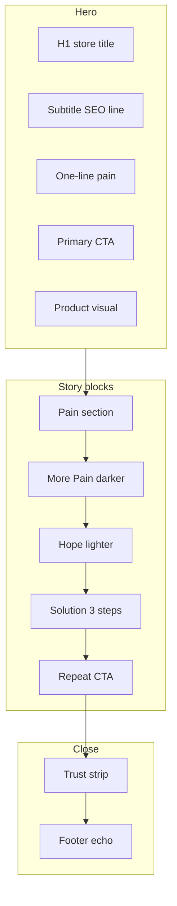

# Лендинг расширения Steal the Vibe — структура Pain → More Pain → Hope → Solution

**SEO (3 кластера, без программатика):** см. `docs/extension-landing-seo-requirements.md`.

Каркас маркетингового сайта под **вариант 3 (subtitle)**: title остаётся «чистым» и совпадает со стором; SEO и раскрытие смысла — в подзаголовке и теле страницы.

## Связка с Chrome Web Store

| Chrome Web Store | На лендинге |
|------------------|-------------|
| **Title:** Steal the Vibe – AI Photo Prompt Generator | **H1** (одна строка, 1:1 со стором — узнаваемость) |
| **Short description:** Recreate any image with AI. Image to prompt + style transfer. | **Hero subtitle** под H1 + **meta description** + короткий блок «что это» |

Так title остаётся кликабельным/брендовым, а запросы вроде *image to prompt*, *style transfer*, *recreate image with AI* живут в subtitle и секциях ниже.

---

## Секции по схеме Pain → More Pain → Hope → Solution

### 1. Hero (сразу боль + обещание)

- **H1:** Steal the Vibe – AI Photo Prompt Generator
- **Subtitle (из стора):** Recreate any image with AI. Image to prompt + style transfer.
- **1 строка боли (Pain):** Например: *You love a look online — but you can’t describe it well enough for your AI tool.*
- **CTA:** Add to Chrome / Open extension (одна главная кнопка)

Цель: за ~3 секунды понять продукт и узнать название из стора.

---

### 2. Pain — расширенная боль («узнаваемая ситуация»)

**Заголовок секции (пример):** *You don’t need “a prompt.” You need the same vibe.*

Тезисы:

- Видишь референс — непонятно, **что именно** копировать: свет, палитра, композиция, текстура.
- Пишешь от руки — результат «рядом, но не то», много итераций.
- Прыжки между вкладками, скрины, копипаст — **трение**, а не творчество.

Опционально: один визуал «референс vs промпт в блокноте».

---

### 3. More Pain — усиление («просто попробовать ещё раз» не работает)

**Заголовок:** *Guessing prompts is expensive.*

Тезисы:

- Сжигаются **кредиты/время** на угадайку формулировок.
- Один и тот же стиль **не воспроизводится** между сессиями.
- Нет **общего языка** между «картинкой в браузере» и «полем промпта в генераторе».

Смысл: проблема не в лени, а в **разрыве между картинкой и текстом**.

---

### 4. Hope — поворот

**Заголовок:** *What if the image *is* the brief?*

Идеи (2–3 строки):

- Указываешь на картинку → получаешь **структурированный промпт** под свой пайплайн.
- Подставляешь **своё фото** — сохраняешь **стиль/настроение** референса (image to prompt + style transfer из subtitle).
- Всё **рядом с тем сайтом**, где уже смотришь картинки — без «сначала открой десять вкладок».

---

### 5. Solution — продукт как ответ

**Заголовок:** *Steal the Vibe — in one flow.*

**Как это работает** (3 шага):

1. **Capture** — навести/выбрать изображение на странице.
2. **Extract** — AI вытаскивает промпт (и при необходимости детали стиля).
3. **Recreate** — загрузить своё фото и получить результат в том же вайбе.

Ниже: буллеты по реальным возможностям экстеншена (оверлей, копирование промпта, аккаунт/API и т.д.).

Повтор **CTA** + при необходимости ссылки на политику/права.

---

### 6. Доверие и границы (коротко, после Solution)

- Для кого: дизайнеры, контент, любители AI-фото.
- Честная граница: результат зависит от модели и исходника.
- Логотип Chrome Web Store, при наличии — отзывы/скриншоты.

---

### 7. Футер

- Повтор **title + short description** компактным блоком (доп. SEO без перегруза H1).
- Privacy, Support, ссылка на стор.

---

## Мета и единый голос

- **`<title>` / OG:** тот же title, что в сторе.
- **`description`:** дословно short description из стора (или слегка расширенная строка ~155–160 символов, например с *right in your browser*).
- **H1:** не раздувать длинными SEO-фразами — только бренд + короткая роль, как в варианте 3.

---

## Резюме одной цепочкой

| Этап | Смысл |
|------|--------|
| **Pain** | Вижу референс — не могу описать. |
| **More Pain** | Угадайка промптов = время/деньги и нестабильный стиль. |
| **Hope** | Картинка сама становится брифом. |
| **Solution** | Steal the Vibe: image → prompt → своё фото в том же стиле; H1 = стор title, subtitle = стор description. |

---

## Визуальная схема страницы (дизайн под эти требования)

Ниже — как может выглядеть **отдельный маркетинговый лендинг расширения** (не каталог PromptShot): одна колонка, много воздуха, акцент на продукте и истории Pain → Hope → Solution.

### 1. Продукт и проблема (кратко)

- **Продукт:** браузерное расширение: картинка на странице → промпт → стиль на своём фото.
- **Боль:** референс есть, слов нет; угадайка промптов дорого и нестабильно.
- **Обещание:** картинка = бриф; поток в один заход из браузера.

### 2. Структура страницы (секции сверху вниз)

1. **Sticky header** — логотип/название STV, вторичная ссылка «Web», primary CTA «Add to Chrome» (компактно).
2. **Hero** — H1 + subtitle из стора + одна строка pain + CTA + **один главный визуал** (скрин оверлея или короткое demo-loop).
3. **Pain** — заголовок + 3 коротких тезиса + опционально split-visual (референс | хаос промпта).
4. **More Pain** — более плотный, «тёмнее» визуально блок (ниже по яркости фона): 3 тезиса про цену угадайки.
5. **Hope** — светлый поворот: короткий абзац + 3 benefit-строки; можно лёгкий градиент или одна «карта» image → prompt.
6. **Solution** — три шага Capture / Extract / Recreate в **горизонтальном ряду** (desktop) / стек (mobile) + скриншоты; второй CTA.
7. **Доверие** — одна строка «для кого» + disclaimer + бейдж Chrome Web Store / звёзды.
8. **Футер** — компактный повтор title + short description + ссылки.

### 3. Макет по секциям (wireframe-уровень)

```
┌─────────────────────────────────────────────────────────────┐
│  [STV]                    [PromptShot?]     [Add to Chrome] │
├─────────────────────────────────────────────────────────────┤
│                         HERO (center)                        │
│   Steal the Vibe – AI Photo Prompt Generator                 │
│   Recreate any image with AI. Image to prompt + style ...    │
│   You love a look online — but you can't describe it...     │
│              [  Add to Chrome  ]  [ Watch demo ]             │
│                                                              │
│        ┌──────────────────────────────────────┐              │
│        │   browser mock + extension overlay   │              │
│        └──────────────────────────────────────┘              │
├─────────────────────────────────────────────────────────────┤
│  PAIN          headline left          [ visual | bullets ]   │
├─────────────────────────────────────────────────────────────┤
│  MORE PAIN     darker band, 3 columns icons + one line each  │
├─────────────────────────────────────────────────────────────┤
│  HOPE          centered narrative + 3 checks or short cards  │
├─────────────────────────────────────────────────────────────┤
│  SOLUTION      [1.Capture] [2.Extract] [3.Recreate]          │
│                screenshot under each OR one wide UI shot     │
│                        [ Add to Chrome ]                     │
├─────────────────────────────────────────────────────────────┤
│  TRUST         audience + honest line + store badge          │
├─────────────────────────────────────────────────────────────┤
│  FOOTER        title + subtitle (small) · Privacy · Support  │
└─────────────────────────────────────────────────────────────┘
```

### 4. Поток внимания пользователя (mermaid)



### 5. Визуальный стиль (уровень «премиум SaaS 2026»)

| Элемент | Рекомендация |
|--------|----------------|
| **Фон** | База `#FAFAFA` или белый; hero — очень мягкий radial (как нынешний каталог, но слабее) или нейтральный серо-синий туман; блок More Pain — `#18181B` или `#0C0C0E` с светлым текстом для контраста «усиления боли». |
| **Акцент** | Один акцент (например indigo/violet **или** чистый чёрный CTA как у Linear); не смешивать три брендовых цвета. |
| **Типографика** | Один геометрический sans (Inter / уже в лендинге ок); H1 `tracking-tight`, крупный межстрочный в подзаголовке; body `text-zinc-600` на светлом, `text-zinc-300` на тёмном блоке. |
| **Сетка** | `max-w-6xl` контент, hero текст `max-w-2xl`–`3xl` по центру; секции `py-20`–`py-28` для воздуха. |
| **Карточки / шаги** | Тонкая граница `border-zinc-200`, `rounded-2xl`, без тяжёлых теней; hover — лёгкий подъём или смена бордера. |
| **CTA** | Одна primary кнопка на экран в hero и повтор в Solution; secondary — text link или ghost «Privacy». |

### 6. UX-детали

- **Первый экран:** CTA и ключевой визуал видны без скролла на типичном laptop (визуал можно чуть обрезать снизу как teaser).
- **Скролл:** лёгкий `scroll-mt` у секций, если добавишь якоря в хедере (опционально).
- **Доверие:** логотип Chrome рядом с CTA в hero (маленький) дублирует социальное доказательство до скролла.
- **Стор:** все CTA ведут на одну и ту же ссылку Chrome Web Store; текст кнопки не плодить («Add to Chrome» достаточно).

### 7. Что сделает страницу «дороже»

- **Один сильный product shot** вместо трёх мелких в hero.
- **Инверсия** в More Pain: зрительная пауза между «светлой болью» и «надеждой».
- **Три шага** с реальными UI-кадрами из экстеншена, не стоковыми людьми.
- **Короткие строки** в Pain/More Pain (одна мысль на строку — как у Apple product pages).
- **Честный disclaimer** визуально отделён (меньший кегль, нейтральный цвет) — повышает доверие без шума.

### 8. Связь с вариантом 3 (title / subtitle)

- В шапке и hero **не** дублировать длинные SEO-фразы в H1: только **store title**.
- **Short description** — первая строка под H1 и дубли в meta + футер; дополнительные ключи (*image to prompt*, *style transfer*) можно один раз в body секций Hope/Solution, без переспама в заголовках.

---

## Локальный превью (реализация в репо)

Статическая вёрстка под эту спеку: маршрут **`/extension-stv`** в приложении `landing/` (`landing/src/app/extension-stv/`). Без сайдбара каталога; **`metadata.robots: noindex`** (черновик превью).

```bash
cd landing && npm run dev
# http://localhost:3001/extension-stv
```

Опционально в `.env.local`: **`NEXT_PUBLIC_STV_CHROME_STORE_URL`** — URL листинга в Chrome Web Store для кнопок «Add to Chrome» (иначе заглушка `#stv-chrome-store`). Шаблон переменной — `landing/.env.example`.
