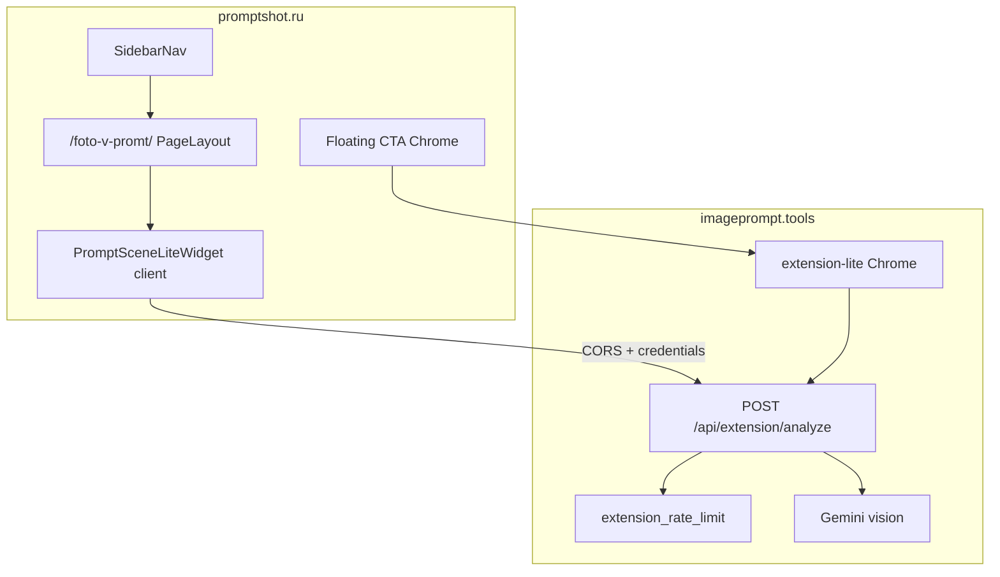

# Требования: страница «Фото в промпт» (`/foto-v-promt/`)

> **Дата:** 2026-06-02 (rev: §6 — backend на imageprompt, в aiphoto только страница)  
> **Статус:** черновик требований (реализации нет — этот файл задаёт объём работ).  
> **Маршрут:** **`/foto-v-promt/`** на лендинге promptshot.ru (`landing/`).  
> **Ветка реализации:** `feature/02-06-foto-v-promt-page`  
> **Референс:** [imageprompt.tools/ru/ai-image-describer](https://www.imageprompt.tools/ru/ai-image-describer) — репозиторий [github.com/azarovmaxim/imageprompt](https://github.com/azarovmaxim/imageprompt), локально `~/imageprompt`.

---

## 1. Продукт и цели

### 1.1 Задача

На **promptshot.ru** нужна отдельная **индексируемая** посадочная под кластер «фото → промпт» / image-to-prompt. Страница живёт **в chrome каталога** (левое меню, светлая тема), а не как standalone dark-лендинг.

Пользователь должен:

1. Узнать про инструмент **AI Image Describer** (расширение Chrome).
2. **На странице** загрузить фото и получить текстовый промпт (live-виджет).
3. Перейти в Chrome Web Store и установить расширение.

### 1.2 Цели (acceptance на уровне продукта)

| ID | Цель | Критерий успеха |
|----|------|-----------------|
| **G1** | SEO-посадочная RU | Страница в sitemap, `index, follow`, уникальные title/description, canonical без локалей |
| **G2** | Live image-to-prompt | Upload JPEG/PNG/WebP → промпт через **`POST https://imageprompt.tools/api/extension/analyze`** (существующая ручка imageprompt), лимиты и ошибки как на референсе |
| **G3** | Discoverability | Пункт «Фото в промпт» в левом меню под «Главная» |
| **G4** | Визуальная целостность | Светлая тема каталога PromptShot, не тёмный shell `/extension-stv` |

### 1.3 Жёсткие ограничения

- **Только RU:** тексты захардкожены или в `foto-v-promt-copy.ts`. **Не** подключать `next-intl`, **не** добавлять префикс `/ru/`, **не** добавлять hreflang/alternates на другие языки.
- **Не** добавлять i18n-инфраструктуру в promptshot ради этой страницы.
- Бренд в UI/SEO: **PromptShot**; продукт расширения: **AI Image Describer** (имя listing в Chrome Web Store).
- Тексты — из RU-блока `Marketing.*` и `PromptSceneLite.*` imageprompt (см. [Приложение A](#appendix-a-ru-copy)), с заменой **ImagePrompt → PromptShot** там, где речь о **странице/SEO promptshot.ru**; backend, auth и extension-lite остаются на **imageprompt.tools** (см. §6).
- **Не дублировать backend** в репозитории aiphoto: API, rate limit, SQL, Gemini — уже реализованы в проекте **imageprompt**.

### 1.4 Отличие от `/extension-stv`

| | `/extension-stv` (уже есть) | `/foto-v-promt/` (новая) |
|--|----------------------------|---------------------------|
| Shell | Тёмный standalone layout | `PageLayout` + `SidebarNav` (каталог) |
| Продукт | Steal the Vibe / Image To Prompt (STV) | AI Image Describer |
| SEO | `robots: noindex` | `index, follow` |
| Язык | EN (маркетинг) | RU |
| Меню каталога | Нет | Отдельный пункт |

---

## 2. URL, SEO и метаданные

| Поле | Значение |
|------|----------|
| **Path** | `/foto-v-promt/` (trailing slash как у каталога) |
| **Canonical** | `https://promptshot.ru/foto-v-promt/` |
| **robots** | `{ index: true, follow: true }` |
| **H1 (страница)** | **«Фото в промпт»** — понятный RU-заголовок для пользователя |
| **Nav label** | **«Фото в промпт»** |
| **Title** | `Фото в промпт — AI Image Describer, расширение Chrome \| PromptShot` (~60 символов, уточнить при вёрстке) |
| **Description** | «Превратите любое фото в готовый промпт для Midjourney, DALL·E, Stable Diffusion и других моделей. Live-разбор на PromptShot, backend — imageprompt.tools, расширение AI Image Describer для Chrome.» |
| **Open Graph** | `type: website`, `url` = canonical, `siteName: PromptShot` |
| **JSON-LD** | `@type: WebApplication`, `applicationCategory: BrowserApplication` (как `ExtensionMarketingProductPage` на imageprompt) |

**Не делать:** `alternates.languages`, `x-default`, программатические клоны URL, префикс `/ru/`.

**Sitemap** — добавить в `landing/src/app/sitemap.ts`:

```typescript
{
  url: `${BASE_URL}/foto-v-promt`,
  lastModified: new Date(),
  changeFrequency: "weekly",
  priority: 0.8,
}
```

**robots.ts** — не добавлять `/foto-v-promt` в `disallow`.

---

## 3. Навигация

### 3.1 Левое меню (`SidebarNav`)

Файл: `landing/src/components/SidebarNav.tsx`.

- После hardcoded **«Главная»** (`/`), **до** divider с TAG-секциями.
- Новый пункт: **«Фото в промпт»** → `/foto-v-promt/`.
- Active state: тот же паттерн, что у «Главная» — `bg-indigo-50 text-indigo-700` при `pathname === '/foto-v-promt'` (нормализация trailing slash как в `normalizePath`).
- Иконка: document/image (SVG inline, `h-4 w-4`, stroke).
- Mobile drawer: тот же пункт, закрытие drawer по клику (`onItemClick`).

### 3.2 Footer (P1, желательно в v1)

Файл: `landing/src/components/Footer.tsx` — добавить ссылку «Фото в промпт» в блок «Навигация» рядом с «Главная».

---

## 4. Layout и визуальная адаптация

### 4.1 Shell

- Обёртка: **`PageLayout`** (`landing/src/components/PageLayout.tsx`) — header, sidebar, footer, mobile bottom bar.
- **Не** использовать `extension-stv/layout.tsx` (тёмный standalone).
- **Не** переносить `HomeAnchorSidebar` с imageprompt — якорная навигация по секциям не нужна; пользователь уже в каталоговом sidebar.

### 4.2 Правила light-theme адаптации

Референс imageprompt — тёмный canvas (`zinc-950`, `text-zinc-50`). На promptshot — **светлый каталог** (white / zinc-900 / indigo accents). Следовать [.cursor/rules/ui-typography-icons-consistency.mdc](../../.cursor/rules/ui-typography-icons-consistency.mdc).

| Элемент imageprompt | Адаптация на promptshot |
|---------------------|-------------------------|
| Hero `text-zinc-50` на тёмном фоне | `text-zinc-900` заголовок, `text-zinc-600` подзаголовок на `bg-white` |
| Radial gradients indigo/violet на тёмном | Лёгкий `from-indigo-50/40` / radial как на главной каталога |
| Widget surfaces `zinc-950`, `border-white/10` | `bg-white`, `border-zinc-200`, `shadow-sm` |
| FAQ `text-zinc-100`, dark cards | `text-zinc-900` / `text-zinc-600`, `border-zinc-200`, `open:bg-indigo-50/50` |
| HowItWorks prompt block `bg-zinc-950/95` | `bg-zinc-50`, `border-indigo-200`, `text-zinc-800` |
| Step numbers indigo on dark | Те же indigo badges — контраст на светлом фоне |
| Floating CTA тёмная pill `#09090b` | Indigo primary: `bg-indigo-600 text-white hover:bg-indigo-700`, `rounded-full` |
| Floating CTA `lg:left-60` offset | Учесть ширину sidebar каталога (`240px` / `w-60`) — тот же offset |
| Section titles `text-zinc-50` | `text-zinc-900` |

### 4.3 Mobile

- Контент не перекрывается **`ListingBottomBar`**: у main добавить нижний padding (`listing-main-bottom-pad` или `pb-32` под floating CTA).
- Floating CTA: `z-index` выше bottom bar, safe-area для iOS.
- Виджет: touch-friendly зона загрузки, не ломать scroll root `listing-scroll-root`.

---

## 5. Структура страницы и контент

Секции — по структуре `ExtensionStvMarketingSections` с `heroVariant="extension"` на imageprompt. Порядок:

1. **Hero** — H1 + subtitle (см. [Приложение A.1](#a1-hero)).
2. **Live demo** — UI виджета (из imageprompt), вызывающий **готовую** ручку imageprompt (см. §6); логику analyze/rate limit **не** реализовывать в aiphoto.
3. **How it works** — заголовок, intro, иллюстрация + 5 шагов + prompt snippet (см. [A.2](#a2-how-it-works)).
4. **FAQ** — 7 пар Q/A (см. [A.3](#a3-faq)).
5. **Floating CTA** — «Добавить в Chrome» → AI Image Describer в Chrome Web Store.

**Не включать в v1:**

- Pricing (`ExtensionStvPricing` — на imageprompt закомментирован).
- Testimonials.
- `ExtensionStvMarketingHeader` / `ExtensionStvMarketingFooter` (отдельный header/footer STV).
- Страница `/foto-v-promt/welcome` (post-install).
- `HomeAnchorSidebar`.

### 5.1 CTA Chrome Web Store

- **URL по умолчанию:**  
  `https://chromewebstore.google.com/detail/ai-image-describer/ccidgdhgephaicccgjenjilnjjippkkl`
- **Env override:** `NEXT_PUBLIC_AI_IMAGE_DESCRIBER_CHROME_URL` (предпочтительно новое имя; fallback на значение из `stv-marketing-shared` imageprompt).
- Атрибуты ссылки: `target="_blank"`, `rel="noopener noreferrer"`.

### 5.2 Ассеты

Перенести или переиспользовать с imageprompt:

- `public/icons/icon-widget-star.png` — FAB в блоке How it works.
- Референс-фото для How it works: `PAIN_REFERENCE_IMAGE_SRC` из `stv-mock-shared.ts` (скопировать asset в `landing/public/` при необходимости).

---

## 6. Backend и интеграция с imageprompt (без переноса в aiphoto)

**Принцип:** в репозитории **aiphoto** делаем **только страницу** `/foto-v-promt/` (маркетинг + клиентский виджет). Вся серверная логика, rate limit, Gemini и **extension-lite** уже живут в проекте **imageprompt** — **переиспользуем as-is**, ничего не копируем в `landing/src/app/api/` promptshot.

### 6.1 Что уже готово в imageprompt (source of truth)

| Компонент | Где | Роль |
|-----------|-----|------|
| **`POST /api/extension/analyze`** | `~/imageprompt/landing/src/app/api/extension/analyze/route.ts` | Vision → промпт (Gemini 2.5 Flash) |
| **Rate limit** | `extension-rate-limit.ts`, SQL `13-05-*`, `13-06-*` | IP / user buckets, `extension_rate_limit_per_day` |
| **Extension lite (AI Image Describer)** | `~/imageprompt/extension-lite/` | MV3 в Chrome Web Store; context menu, popup, вызов той же API |
| **PromptSceneLiteWidget** | `~/imageprompt/landing/src/components/extension-stv/` | Клиент: upload, paste, URL, history, `fetch(..., credentials: "include")` |

Контракт API (без изменений):

| Поле | Значение |
|------|----------|
| URL (prod) | `https://imageprompt.tools/api/extension/analyze` |
| Body | `{ image_base64?: string, image_url?: string, style?: "photoreal" \| "midjourney" \| "sd" \| "flux" }` — ровно одно из base64 / url |
| Лимит размера | 10 MB |
| Форматы | JPEG, PNG, WebP, GIF |
| Успех | `{ prompt: string, style: string }` |
| Ошибки | `400 invalid_image`, `429 rate_limited`, `500` |

### 6.2 Что делаем на promptshot (только клиент страницы)

1. **Маркетинговые секции** — hero, How it works, FAQ, floating CTA (светлая тема, RU copy).
2. **Виджет demo** — UI на базе `PromptSceneLiteWidget` / `PromptSceneLiteWidgetGate` из imageprompt, но:
   - `API_PATH` = **`${NEXT_PUBLIC_IMAGEPROMPT_API_ORIGIN}/api/extension/analyze`** (не relative `/api/...` на promptshot).
   - `fetch(..., { credentials: "include" })` — как на imageprompt (cookies сессии **imageprompt.tools**, если пользователь там залогинен).
   - RU-строки — из `foto-v-promt-copy.ts`, без `next-intl`.
   - Светлая тема виджета (§4.2).
   - Клиентские хелперы (`image-upload-prepare`, `extension-lite-recognition-history`) — **скопировать только как browser-side lib**, без server route.
3. **CTA Chrome** — тот же listing **AI Image Describer** (extension lite), URL из §5.1.

**Не создавать в aiphoto:**

- `landing/src/app/api/extension/analyze/route.ts`
- `extension-rate-limit*.ts` (server-side)
- SQL-миграции `extension_rate_limit*` в `sql/` promptshot
- Env `GEMINI_API_KEY` **ради analyze** (Gemini только на imageprompt)

### 6.3 CORS и auth (зависимость imageprompt)

Виджет на **promptshot.ru** вызывает API на **imageprompt.tools** (cross-origin). На стороне **imageprompt** (деплой / env):

| Требование | Детали |
|------------|--------|
| **CORS** | Добавить `https://promptshot.ru` (и при необходимости `https://www.promptshot.ru`, localhost для dev) в `CORS_ALLOWED_ORIGINS` — см. `~/imageprompt/landing/src/middleware.ts` |
| **Credentials** | Уже: `Access-Control-Allow-Credentials: true` при совпадении Origin |
| **Extension lite** | `CHROME_EXTENSION_ID_LITE` уже в allowlist middleware; extension **не** переключать на promptshot API |

**Auth UX на странице promptshot:**

- **Guest:** analyze до IP-лимита imageprompt (без cookies promptshot).
- **Signed-in (единый лимит с extension):** сессия **Google на imageprompt.tools** — **не** auth promptshot (`HeaderClient`). В виджете: «Продолжить с Google» → OAuth **на imageprompt** (тот же flow, что на `/ru/ai-image-describer`).
- При `429` + `auth_required: true` — подсказка войти на **imageprompt.tools**.
- Auth promptshot (избранное, генерации каталога) **не** участвует в analyze.

**История виджета:** `localStorage` — **per-origin**; на promptshot.ru история отдельная от imageprompt.tools. Текст `historyIntro`: «Записи сохраняются в этом браузере на этой странице».

### 6.4 Env-переменные (только promptshot)

Добавить в `landing/.env.example` aiphoto:

| Variable | Пример | Назначение |
|----------|--------|------------|
| `NEXT_PUBLIC_IMAGEPROMPT_API_ORIGIN` | `https://imageprompt.tools` | Base URL для `POST .../api/extension/analyze` |
| `NEXT_PUBLIC_AI_IMAGE_DESCRIBER_CHROME_URL` | Chrome Web Store listing | Floating CTA |

**Не добавлять** в aiphoto для этой фичи: `GEMINI_API_KEY`, `CHROME_EXTENSION_ID_LITE`, `CORS_*` — конфиг **imageprompt**.

### 6.5 Чеклист готовности imageprompt (перед выкатом страницы)

- [ ] `https://promptshot.ru` в `CORS_ALLOWED_ORIGINS` на prod imageprompt
- [ ] `POST /api/extension/analyze` отвечает с Origin promptshot.ru (smoke: upload → prompt)
- [ ] Extension lite в Store без изменений; CTA на странице ведёт на тот же listing

---

## 7. Карта файлов (что создаём в aiphoto)

Предпочтение: **отдельный namespace `foto-v-promt/`**, не смешивать с noindex `/extension-stv`.

**Создаём / правим в aiphoto:**

| Действие | Путь |
|----------|------|
| Новый route | `src/app/foto-v-promt/page.tsx` — metadata, JSON-LD, `PageLayout`, секции |
| Маркетинг (light) | `src/components/foto-v-promt/FotoVPromtSections.tsx`, `FotoVPromtHowItWorks.tsx`, `FotoVPromtFaq.tsx`, `FotoVPromtFloatingCta.tsx` |
| Виджет (клиент → imageprompt API) | `src/components/foto-v-promt/PromptSceneLiteWidgetGate.tsx`, `PromptSceneLiteWidget.tsx` |
| RU copy | `src/lib/foto-v-promt-copy.ts` |
| Browser-only lib (из imageprompt) | `src/lib/image-upload-prepare.ts`, `src/lib/extension-lite-recognition-history.ts` — **без** server deps |
| Меню / sitemap | правки `SidebarNav.tsx`, `sitemap.ts`; опционально `Footer.tsx` |
| Env | `NEXT_PUBLIC_IMAGEPROMPT_API_ORIGIN`, `NEXT_PUBLIC_AI_IMAGE_DESCRIBER_CHROME_URL` в `.env.example` |

**Референс UI (копировать и адаптировать, не дублировать backend):**

| Источник (`~/imageprompt/landing/`) | Использование |
|-------------------------------------|---------------|
| `ExtensionStvMarketingSections.tsx` | Структура секций → `FotoVPromtSections` |
| `ExtensionStvHowItWorks.tsx`, `ExtensionStvFaq.tsx` | Layout + тексты |
| `PromptSceneLiteWidget*.tsx` | Виджет; **единственное изменение логики** — absolute API URL |
| `ExtensionStvFloatingCtaChrome.tsx`, `stv-mock-shared.ts` | CTA + assets |

**Не переносить в aiphoto:**

| Источник imageprompt | Причина |
|----------------------|---------|
| `src/app/api/extension/analyze/route.ts` | API остаётся на imageprompt.tools |
| `extension-rate-limit*.ts` (server) | Rate limit на imageprompt |
| SQL `extension_rate_limit*` | БД imageprompt |
| `next-intl`, `[locale]/*`, product registry | Out of scope |
| `HomeAnchorSidebar.tsx` | Не нужен на promptshot |

---

## 8. Архитектура (data flow)



---

## 9. Документация после реализации

Обновить [docs/architecture/01-landing.md](../architecture/01-landing.md):

- Маршрут `/foto-v-promt/`
- Пункт меню, sitemap entry
- Клиент виджета → `NEXT_PUBLIC_IMAGEPROMPT_API_ORIGIN` (backend **не** в aiphoto)

Документация API analyze / rate limit — в репозитории **imageprompt** (без дублирования в aiphoto).

---

## 10. Out of scope

- Локализация EN и другие языки; hreflang.
- Страница `/foto-v-promt/welcome` (post-install extension).
- Pricing / подписки ImagePrompt на promptshot.
- **Порт backend analyze / rate limit / SQL в aiphoto** — всё на imageprompt.
- Изменения **extension-lite** и welcome URL extension (остаются на imageprompt.tools).
- Рефакторинг `/extension-stv` (остаётся noindex EN-лендинг STV).
- Переключение extension-lite на API promptshot.ru.

---

## 11. Риски и митигация

| Риск | Митигация |
|------|-----------|
| **Cross-origin CORS** | Добавить promptshot.ru в `CORS_ALLOWED_ORIGINS` на imageprompt до выката; smoke-тест fetch с credentials |
| **Auth на другом origin** | Явный CTA «Войти на imageprompt.tools»; не смешивать с auth promptshot |
| **История виджета per-origin** | Зафиксировать в copy; общая история с imageprompt — out of scope v1 |
| **Gemini costs / rate limit** | Мониторинг на стороне imageprompt (`[extension.analyze]`) |
| **SEO-каннибализация** с `/extension-stv` | `/extension-stv` — noindex; `/foto-v-promt/` — RU landing image-to-prompt |
| **Mobile overlap** CTA vs bottom bar | `pb-32`, z-index, smoke на устройстве |

---

## 12. Acceptance criteria (чеклист)

- [ ] `/foto-v-promt/` открывается в `PageLayout` со **светлой** темой каталога
- [ ] Пункт **«Фото в промпт»** в sidebar под «Главная»; active state корректен
- [ ] URL присутствует в `/sitemap.xml` с priority 0.8
- [ ] `title`, `description`, canonical, Open Graph, JSON-LD WebApplication
- [ ] Hero, HowItWorks, FAQ — RU-тексты по [Приложению A](#appendix-a-ru-copy)
- [ ] Виджет: upload JPEG/PNG/WebP → промпт через **`https://imageprompt.tools/api/extension/analyze`**; copy; history; rate limit 429
- [ ] CTA «Добавить в Chrome» → тот же AI Image Describer listing (extension lite)
- [ ] **Нет** `/ru/` prefix и hreflang
- [ ] Mobile: floating CTA и виджет не конфликтуют с `ListingBottomBar`
- [ ] **Нет** `landing/src/app/api/extension/analyze` в aiphoto
- [ ] `NEXT_PUBLIC_IMAGEPROMPT_API_ORIGIN` задан на prod promptshot
- [ ] На imageprompt: `CORS_ALLOWED_ORIGINS` включает `https://promptshot.ru`
- [ ] `docs/architecture/01-landing.md` обновлён

---

## Приложение A. RU copy {#appendix-a-ru-copy}

Источник: `~/imageprompt/landing/src/messages/ru.json`. При реализации — файл `landing/src/lib/foto-v-promt-copy.ts`.

### A.1 Hero {#a1-hero}

**H1:** `Фото в промпт`

**Subtitle (heroExtension):**  
«Что даёт AI Image Describer: экономьте время — опишите картинку текстом в один клик и скопируйте готовый промпт, чтобы собрать похожее изображение.»

### A.2 How it works {#a2-how-it-works}

**Title:** `Как это работает`

**Subtitle (subtitleP1):**  
«AI Image Describer — расширение для Chrome: за секунды превращает любую картинку в понятное текстовое описание и готовый промпт для творчества. Это быстрый image describer прямо в браузере: опишите изображение в привычном рабочем процессе без лишних вкладок, без регистрации и без вставки ссылок в кучу разных сервисов.»

**Steps:**

1. Закрепите AI Image Describer на панели инструментов Chrome.
2. Нажмите на значок расширения и загрузите или вставьте картинку, чтобы получить описание этого фото.
3. Или щёлкните правой кнопкой по любому изображению на сайте и запустите анализ прямо из контекстного меню.
4. Скопируйте текст промпта.
5. Дорабатывайте, смешивайте и переиспользуйте.

**Prompt snippet (блок «prompt»):**  
«Если вы смотрели на изображение и не могли подобрать слова — ai image describer сделает это за вас. Загрузите картинку, и инструмент вернёт чёткий промпт для этой сцены, который можно сразу вставить в Nano Banana, Midjourney, DALL·E, Stable Diffusion или любую модель генерации по изображению.»

### A.3 FAQ {#a3-faq}

**Title:** `Частые вопросы`  
**Subtitle:** `AI Image Describer в браузере — коротко про описание картинок в промпт и расширение Chrome.`

| # | Вопрос | Ответ |
|---|--------|-------|
| 1 | Что на самом деле делает AI Image Describer, когда вы просите описать это изображение? | Он читает содержание картинки и возвращает аккуратное описание-в-подсказку, которое можно скопировать и использовать снова. |
| 2 | Что делать, если нужно именно «сделай описание этой картинки под AI-сгенерированную часть»? | Вставьте или загрузите изображение. Сервис прочитает кадр и выдаст сжатый объективный визуальный текст для промпта к модели: объекты, композицию, свет и стиль. |
| 3 | Можно ли использовать это для picture-to-prompt в Midjourney или DALL·E? | Да. Это работает как AI-описатель фото под популярные модели, а режим «описать это изображение» обрабатывает картинки по одной. |
| 4 | Сохраняются ли мои промпты? | Да. Расширение ведёт локальную историю результатов описания — можно вернуться к любому промпту. История хранится в браузере, а не в чужом облаке. |
| 5 | Подойдёт ли любая картинка? | Поддерживаются обычные форматы: PNG, JPG и WebP. |
| 6 | Можно ли для референсов? | Да. Многие используют AI Image Describer с сохранёнными референсами, досками вдохновения, макетами, визуальным ресёрчем и материалами с веба. |
| 7 | Нужен ли аккаунт? | Нет. Установите расширение, нажмите на иконку и начинайте — без почты, без карты и без ожидания до первого результата. |

### A.4 Floating CTA

**Label:** `Добавить в Chrome`

### A.5 PromptSceneLite widget (основные строки)

| Key | RU текст |
|-----|----------|
| styleLabel | Стиль промпта |
| stylePhotoreal | Фотореализм |
| styleMidjourney | Midjourney |
| styleSd | Stable Diffusion |
| styleFlux | Flux |
| emptyTitle | Перетащите изображение или вставьте из буфера |
| emptyHint | JPG или PNG, до 10 МБ |
| chooseFile | Выбрать файл |
| analyzing | Разбираем изображение… |
| resultTitle | Промпт |
| copy | Копировать промпт |
| tryAgain | Другой снимок |
| errorRateLimited | Дневной лимит использован. Попробуйте через 24 часа. |
| invalidType | Нужен файл JPG, PNG или WebP. |
| tabAnalyze | Разбор |
| tabHistory | История |
| historyIntro | Записи сохраняются в этом браузере на этой странице. Можно снова разобрать то же изображение в один клик. |
| authHint | Войдите на imageprompt.tools, чтобы дневной бесплатный лимит был единым на сайте и в расширении. |
| authSignIn | Продолжить с Google на imageprompt.tools |

Полный набор ключей — секция `PromptSceneLite` в `ru.json` imageprompt (строки 436–482).

### A.6 Problem / demo (опциональные строки секции)

**painDemo.badge:** `Анализ изображения в реальном времени (нужен вход)`  
**painDemo.addPhoto:** `Добавить своё фото`  
**painDemo.signInHint:** `Сначала войдите через Google на imageprompt.tools, затем снова добавьте фото.`

---

## Связанные документы

- [docs/extension-landing-seo-requirements.md](../extension-landing-seo-requirements.md) — кластеры image-to-prompt / AI photo prompt
- [docs/requirements/30-03-imageprompt-tools-domain-requirements.md](./30-03-imageprompt-tools-domain-requirements.md) — контекст выноса продукта на imageprompt.tools
- [docs/architecture/01-landing.md](../architecture/01-landing.md) — обновить после реализации
